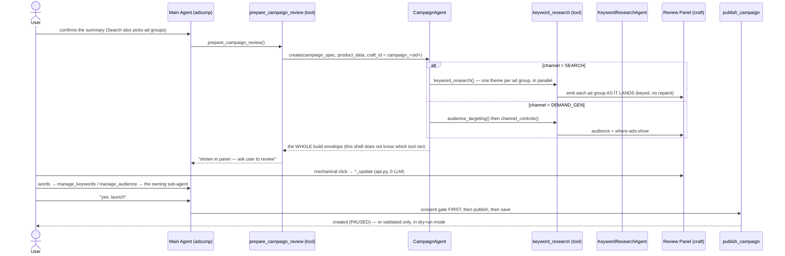

# Campaign Agent

Platform-agnostic **campaign-creation orchestrator**. The main adzump agent spawns it
(via the `prepare_campaign_review` tool) once the user confirms the campaign summary. It owns the
campaign **build** sequence — research, then (as tools land) create, configure, and launch
the campaign on Google/Meta.

It is a thin orchestration layer *by design* — the domain reasoning lives in the tools and
sub-agents it calls — but a **necessary** one: it's where the multi-step, multi-platform
build is sequenced and kept isolated from the main conversation agent (see [§2](#2-why-a-dedicated-agent-not-a-function-or-main-agent-tools)).

Today, two channels: **Search → keyword research** (one ad group per keyword theme the user
chose) and **Demand Gen → audience targeting + channel controls**, which then **posts the
campaign to Google**. Meta and Performance Max slot in as more tools without changing this
shell.

---

## 1. Where it sits

The CampaignAgent doesn't do keyword reasoning itself — that lives in the sub-agents (the
`KeywordResearchAgent`, documented in [`google/keyword/AGENT.md`](google/keyword/AGENT.md)). Its
job is to **own and sequence the platform build**; the next section is why that warrants a
dedicated agent rather than a few tools bolted onto the main agent.

---

## 2. Why a dedicated agent (not a function or main-agent tools)

Campaign creation is a **multi-step, multi-platform build** — research → create campaign →
ad groups → ads → budget / targeting → launch — where steps depend on prior results, any
step can partially fail, and the tool set differs per platform and channel. That shape
needs an orchestration layer with its own loop and session, for concrete reasons:

- **Context isolation.** It runs in its **own sub-session** with only the build tools +
  campaign data. The main conversation agent (17 tools, full chat history) never carries
  platform build tools or their large outputs — its context stays lean and its prompt stays
  focused on talking to the user.
- **Platform dispatch seam.** This is the single place that selects a platform's tool set
  (Google today, Meta next) and branches by channel — Search now; Performance Max has **no
  keywords** (asset groups instead). The main agent stays platform-agnostic.
- **A real loop, not a straight-line call.** The build is a dependency chain — an ad group
  needs the campaign id, ads need the ad group, launch needs all of it — with partial-failure
  handling. An agent loop can sequence, react to a failed step, and stop; a single function
  can't do that cleanly.
- **Clean lifecycle + streaming.** It owns its agent-card span, forwards sub-agent lifecycle
  to the user, and returns one result for the caller to persist for review and launch.
- **Extensibility contract.** A new capability = **one tool + one craft section**; the
  orchestrator, the main agent, and the streaming/craft plumbing don't change.

**Today it runs one build tool per channel (`keyword_research` for Search,
`audience_targeting` for Demand Gen), so the loop is short — but those are the first of the
build tools, not the whole job.** The layer exists precisely so the create/launch tools land
as drop-ins instead of forcing a refactor of the main agent later.

---

## 3. The agent (`agent.py`)

`CampaignAgent(BaseAgent)` — singleton, spawned per campaign by `prepare_campaign_review`.

| Property | Value | Why |
|---|---|---|
| `tools` | `GOOGLE_CAMPAIGN_TOOLS` (`tools/google/registry.py`) | one platform's tools at a time; each gates on the channel and skips when it does not apply |
| `model_tier` | `balanced` | tool-selection orchestration |
| `MAX_TURNS` | 5 | run the build tool(s) and stop — small loop |
| `MAX_TOKENS` | `settings.AGENT_MAX_TOKENS` | provider-sized — a reasoning model spends output tokens deliberating before a tool call, so a hardcoded budget starves it |
| provider | `deepseek` | reasoning model; matches the keyword agent it spawns. Switchable at config level |

`create(campaign_spec, product_data, craft_id, parent_event_stream, auth)` seeds a fresh
sub-session with the collected campaign data, runs the loop, and **returns the whole build
envelope** for `prepare_campaign_review` to persist on the main session.

⚠️ The whole envelope, not one channel's slot: this shell does not know which channel's tool
ran, so reaching for a named slot returns `None` for every other channel — which is exactly
how a Demand Gen build reached the main session as nothing. Streaming goes through `_CampaignStream` (a `ChildAgentStream`) which forwards
panel + sub-agent lifecycle to the parent and swallows the orchestrator's own prose.

`build_dynamic_context` adds one line — `Platform: <x> · Channel: SEARCH` — so the model
knows what it's building; the static persona lives in `context.py`.

---

## 4. Tools

### `tools/google/keyword_research.py` — the orchestrator's first tool (implemented)
What the agent calls today. It:
1. Gates to Google **Search** (PMax/others are skipped honestly).
2. Resolves **which ad groups the user chose** at the review step (`_resolve_themes`
   reads `spec["ad_groups"]`; no `keyword_type` param — the model doesn't pick).
3. Derives the **offering taxonomy** from `product_data` (cached, fail-soft).
4. Resolves **geo** + **location/service areas**.
5. Runs **one theme per chosen ad group in parallel** through the `KeywordResearchAgent`,
   emitting **each ad group's tab as it lands** (progressive). One failing/timing-out still
   returns the other; a timed-out ad group keeps its finished work as `partial`; nothing is
   persisted only if *every* ad group is empty.
6. **Idempotent per ad group** — on the same inputs, an ad group that already has keywords is
   carried forward (`… (kept)`) and only the rest re-run; changed inputs re-run everything.
7. Emits the craft in place via `emit_section_update` (keyed, no repaint); a full
   `emit_campaign_craft` happens only on the first run — see `google/keyword/AGENT.md` §2.0.

Keyword internals (seed → expand → score → select → negatives, the prompts, the gates)
are documented in [`google/keyword/AGENT.md`](google/keyword/AGENT.md) — not duplicated here.

### `tools/google/keyword_update.py` — the shared mutation engine (implemented)
`_apply_edit()` is the single add/delete/edit path, with **two callers**: the review panel's
mechanical clicks (`update_keywords`, 0 LLM — HTTP transport in `api.py`:
`parse_widget_message` + `stream_widget`) **and** the keyword agent's
`edit_keywords` tool for spoken edits. Both mutate the saved set through
the same invariants and re-emit **only** the `keyword_review` block (keyed upsert, no flash),
so an edit made in words can't break a rule a click couldn't. The *words* path is routed by
the main agent's `manage_keywords` tool → `KeywordResearchAgent.handle()` — see
[`google/keyword/AGENT.md` §5](google/keyword/AGENT.md#5-the-manage-flow--answer--edit-after-generation).

### `tools/google/audience_targeting.py` — the Demand Gen build tool (implemented)
The Search tool's counterpart: Demand Gen has no keywords, it reaches people by segment. Gates
to Demand Gen, resolves the **country** first (segment availability is country-scoped, so it
decides what can even be offered), runs the `AudienceAgent` once, persists to
`campaign_build.demand_gen.audience` and emits the panel. Idempotent on the same inputs.

Audience internals (the catalogue, the phases, custom segments, the manage flow) are in
[`google/audience/AGENT.md`](google/audience/AGENT.md) — not duplicated here.

### `tools/google/audience_update.py` — the audience mutation engine (implemented)
Same shape as `keyword_update`: one `apply_edit()` with two callers — panel clicks and the
audience agent's `edit_audience`. Adds re-resolve their ref through the catalogue rather than
trusting it, since a segment reference carries no label, kind or ancestry.

### `tools/google/channel_controls.py` — where ads may show (implemented)
Build tool **and** panel toggle in one module; the change is a single boolean, so splitting it
the way the audience mutation is split would be ceremony. Eligibility rules live in
`google/channel_controls.py`.

### `google/emitter/` + `google/publish.py` — build → the platform (implemented)
`emitter/` turns a finished build into one atomic `googleAds:mutate` payload: shared helpers,
then **one module per channel**, because a channel's payload is not a variation of another's.
`publish.py` posts it with `partialFailure: false`, so a campaign is never half created.

⚠️ `publish_campaign` is deliberately **not** a `ToolDefinition` — an LLM-callable tool could
publish without the consent gate. `launch_campaign` calls it directly, **before** saving, so
the record never describes a launch that did not happen.

### `tools/meta/` — reserved
Placeholder namespace for Meta campaign tools (mirrors `tools/google/`).

### Coming next
Creative — headlines, descriptions and images. It is **platform-level**, not Google-level
(Meta needs the same copy), so the agent sits beside the campaign agent and each platform's
emitter converts one neutral creative into its own shape.

⚠️ Until creative lands a Demand Gen campaign has **no `AdGroupAd`**: it validates and creates,
but cannot serve. That is why it is created `PAUSED` and why `ADZUMP_PUBLISH_DRY_RUN` defaults
on.

The channel is chosen **after** the user confirms the summary, as the first step of the build
stage — it decides which build runs, not which details the summary states. The chips are
generated from the `Channel` enum, so a new channel is offered by existing.

---

## 5. Supporting files

| File | Role |
|---|---|
| `agent.py` | `CampaignAgent` shell + `create()` entry |
| `context.py` | static system prompt (`build_campaign_context`) — small, tool-driven |
| `craft.py` | campaign side-panel builder; **platform dispatch** (`_google_campaign_blocks` / `_meta_campaign_blocks`). `emit_campaign_craft` (full) + `emit_section_update` (append, no flash) |
| `api.py` | Campaign HTTP: `keyword/volume` (scores a panel-added keyword, fail-soft → 0), `audience/search` (segments the panel can offer to add — a ref is opaque, so the panel picks from the catalogue) **and** the review-panel widget transport (`parse_widget_message` + `stream_widget` → `_WIDGET_MUTATIONS`; one dispatch table, fast path, no LLM) |
| `models.py` | the build envelope + accessors. Slots are `dict \| None` — a slot's rules live with the slot |
| `google/keyword/` | Search keyword research — its own [AGENT.md](google/keyword/AGENT.md) |
| `google/audience/` | audience targeting — its own [AGENT.md](google/audience/AGENT.md). **Channel-neutral**: one `Audience` resource also serves Performance Max and App |
| `google/channel_controls.py` | which surfaces an ad may show on. Demand Gen only; eligibility is (ad type × surface) data |
| `google/emitter/` | build → atomic mutate payload. Shared helpers + one module per channel |
| `google/publish.py` | posts it. Not a tool, deliberately — the consent gate lives in `launch_campaign` |
| `tools/google/` | the tools that fill the slots (above) |
| `tools/meta/` | reserved |

---

## 6. Adding a platform or campaign type

The shell is built to extend in one place each:

1. **New tool** under `tools/<platform>/` (e.g. `create_ad_group`, `launch_campaign`,
   Meta equivalents); register it in the agent's tool list.
2. **New craft section** — add a section builder + one dispatch branch in `craft.py`
   (`_<platform>_campaign_blocks`). Nowhere else.
3. The agent shell, `prepare_campaign_review`, and the streaming/craft plumbing stay unchanged.

**Still to come:** Meta tools and Performance Max (no keywords — asset groups instead).

⚠️ **Meta will not fit `CampaignBuild` as it stands.** It is keyed by `Channel`, which is
Google's campaign types, and Meta has no channel — so Meta needs a platform dimension above
the channel one, not another block beside `SearchBuild` / `DemandGenBuild`.

⚠️ **A slot's rules live with the slot, not in `models.py`** — that file is the storage
contract and holds `dict | None`. `google/audience/` is channel-neutral (one `Audience`
resource also serves Performance Max and App); `google/channel_controls.py` is Demand Gen
only. Do not group them under a per-channel folder: it would misfile the audience.

---

## 7. Craft panel note

The campaign craft (`campaign_<session>`) and the product/setup craft (`adzump_<session>`)
are separate panels. A focus-stealing issue between them — and its fix — is documented in
[`google/keyword/AGENT.md` §11](google/keyword/AGENT.md#11-craft-panel-focus-the-two-craft-rule).
