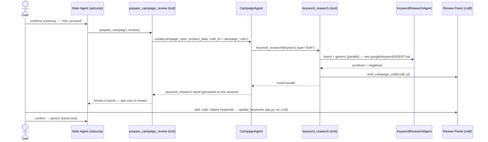

# Campaign Agent

Platform-agnostic **campaign-creation orchestrator**. The main adzump agent spawns it
(via the `prepare_campaign_review` tool) once the user confirms the campaign summary. It owns the
campaign **build** sequence — research, then (as tools land) create, configure, and launch
the campaign on Google/Meta.

It is a thin orchestration layer *by design* — the domain reasoning lives in the tools and
sub-agents it calls — but a **necessary** one: it's where the multi-step, multi-platform
build is sequenced and kept isolated from the main conversation agent (see [§2](#2-why-a-dedicated-agent-not-a-function-or-main-agent-tools)).

Today: **Google Search → keyword research** (brand + generic). Meta, Performance Max, and
the create/launch steps slot in as more tools without changing this shell.

---

## 1. Where it sits

The CampaignAgent doesn't do keyword reasoning itself — that lives in the sub-agents (the
`KeywordResearchAgent`, documented in [`google/keyword/AGENT.md`](google/keyword/AGENT.md)). Its
job is to **own and sequence the platform build**; the next section is why that warrants a
dedicated agent rather than a few tools bolted onto the main agent.

---

## 2. Why a dedicated agent (not a function or main-agent tools)

Campaign creation is a **multi-step, multi-platform build** — research → create campaign →
ad groups → ads → budget / targeting → launch — where steps depend on prior results, any
step can partially fail, and the tool set differs per platform and channel. That shape
needs an orchestration layer with its own loop and session, for concrete reasons:

- **Context isolation.** It runs in its **own sub-session** with only the build tools +
  campaign data. The main conversation agent (17 tools, full chat history) never carries
  platform build tools or their large outputs — its context stays lean and its prompt stays
  focused on talking to the user.
- **Platform dispatch seam.** This is the single place that selects a platform's tool set
  (Google today, Meta next) and branches by channel — Search now; Performance Max has **no
  keywords** (asset groups instead). The main agent stays platform-agnostic.
- **A real loop, not a straight-line call.** The build is a dependency chain — an ad group
  needs the campaign id, ads need the ad group, launch needs all of it — with partial-failure
  handling. An agent loop can sequence, react to a failed step, and stop; a single function
  can't do that cleanly.
- **Clean lifecycle + streaming.** It owns its agent-card span, forwards sub-agent lifecycle
  to the user, and returns one result for the caller to persist for review and launch.
- **Extensibility contract.** A new capability = **one tool + one craft section**; the
  orchestrator, the main agent, and the streaming/craft plumbing don't change.

**Today it runs one tool (`keyword_research`), so the loop is short — but that's the first
of the build tools, not the whole job.** The layer exists precisely so the create/launch
tools land as drop-ins instead of forcing a refactor of the main agent later.

---

## 3. The agent (`agent.py`)

`CampaignAgent(BaseAgent)` — singleton, spawned per campaign by `prepare_campaign_review`.

| Property | Value | Why |
|---|---|---|
| `tools` | `GOOGLE_CAMPAIGN_TOOLS` (= `[keyword_research]`) | one platform's tools at a time |
| `model_tier` | `balanced` | tool-selection orchestration |
| `MAX_TURNS` | 5 | run the build tool(s) and stop — small loop |
| `MAX_TOKENS` | 2000 | it orchestrates; it shouldn't write prose |
| provider | `openai` | — |

`create(campaign_spec, product_data, craft_id, parent_event_stream, auth)` seeds a fresh
sub-session with the collected campaign data, runs the loop, and **returns the
`keyword_research` result** for `prepare_campaign_review` to persist on the main session (for review
+ launch). Streaming goes through `_CampaignStream` (a `ChildAgentStream`) which forwards
panel + sub-agent lifecycle to the parent and swallows the orchestrator's own prose.

`build_dynamic_context` adds one line — `Platform: <x> · Channel: SEARCH` — so the model
knows what it's building; the static persona lives in `context.py`.

---

## 4. Tools

### `tools/google/keyword_research.py` — the orchestrator's first tool (implemented)
What the agent calls today. It:
1. Gates to Google **Search** (PMax/others are skipped honestly).
2. Derives the **offering taxonomy** from `product_data` (cached, fail-soft).
3. Resolves **geo** + **location/service areas**.
4. Runs **brand + generic in parallel** through the `KeywordResearchAgent` (one failing
   or timing out still returns the other).
5. **Idempotent** — same inputs re-show the saved set instead of re-running.
6. Emits the campaign craft via `emit_campaign_craft`.

Keyword internals (seed → expand → score → select → negatives, the prompts, the gates)
are documented in [`google/keyword/AGENT.md`](google/keyword/AGENT.md) — not duplicated here.

### `tools/google/keyword_update.py` — review-panel edits (implemented)
Not an LLM tool — just the mutation logic. The keyword review panel posts structured
widget actions (`add` / `delete` / `edit`) as JSON; the HTTP transport lives in `api.py`
(`parse_keyword_widget_message()` + `stream_keyword_widget()`), which **bypasses the LLM**
and calls `update_keywords()` to mutate `session_ctx["keyword_research"]` and re-emit
**only** the `keyword_review` block (keyed upsert — no panel flash).

### `tools/meta/` — reserved
Placeholder namespace for Meta campaign tools (mirrors `tools/google/`).

### Coming next (the substantive platform work)
The platform create/launch tools — creating the campaign, ad groups, and ads, plus
budget/targeting and the **launch mutation** on the Google/Meta API — are where the agent's
real weight lands. They don't exist yet; the shell is built so each is one tool + one craft
section.

---

## 5. Supporting files

| File | Role |
|---|---|
| `agent.py` | `CampaignAgent` shell + `create()` entry |
| `context.py` | static system prompt (`build_campaign_context`) — small, tool-driven |
| `craft.py` | campaign side-panel builder; **platform dispatch** (`_google_campaign_blocks` / `_meta_campaign_blocks`). `emit_campaign_craft` (full) + `emit_section_update` (append, no flash) |
| `api.py` | Campaign HTTP: `keyword/volume` (scores a panel-added keyword via Planner historical metrics, fail-soft → 0) **and** the review-panel widget transport (`parse_keyword_widget_message` + `stream_keyword_widget` → `update_keywords`; fast path, no LLM) |
| `tools/google/` | implemented Google tools (above) |
| `tools/meta/` | reserved |

---

## 6. Adding a platform or campaign type

The shell is built to extend in one place each:

1. **New tool** under `tools/<platform>/` (e.g. `create_ad_group`, `launch_campaign`,
   Meta equivalents); register it in the agent's tool list.
2. **New craft section** — add a section builder + one dispatch branch in `craft.py`
   (`_<platform>_campaign_blocks`). Nowhere else.
3. The agent shell, `prepare_campaign_review`, and the streaming/craft plumbing stay unchanged.

**Still to come:** Meta tools, Performance Max (no keywords — asset groups instead), and
the actual create/launch mutations (today the flow researches + reviews; launch is the
next tool).

---

## 7. Craft panel note

The campaign craft (`campaign_<session>`) and the product/setup craft (`adzump_<session>`)
are separate panels. A focus-stealing issue between them — and its fix — is documented in
[`google/keyword/AGENT.md` §10](google/keyword/AGENT.md#10-craft-panel-focus-the-two-craft-rule).
