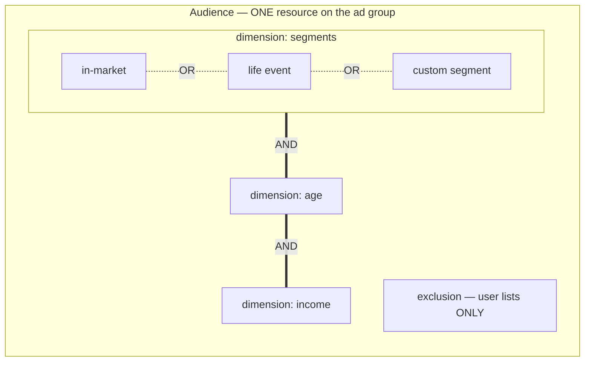
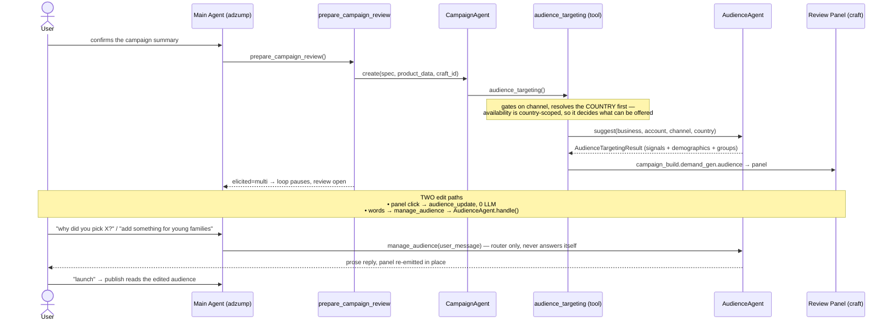
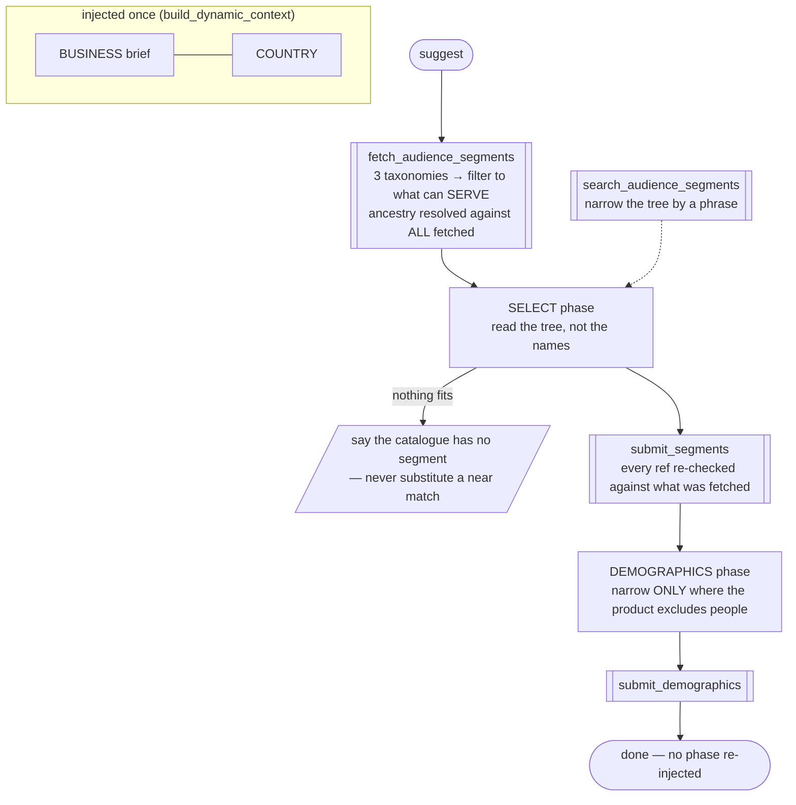
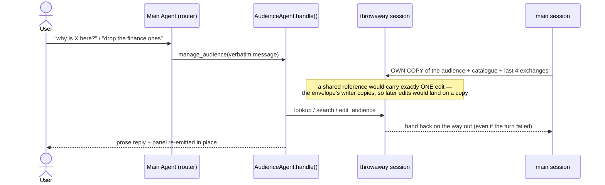
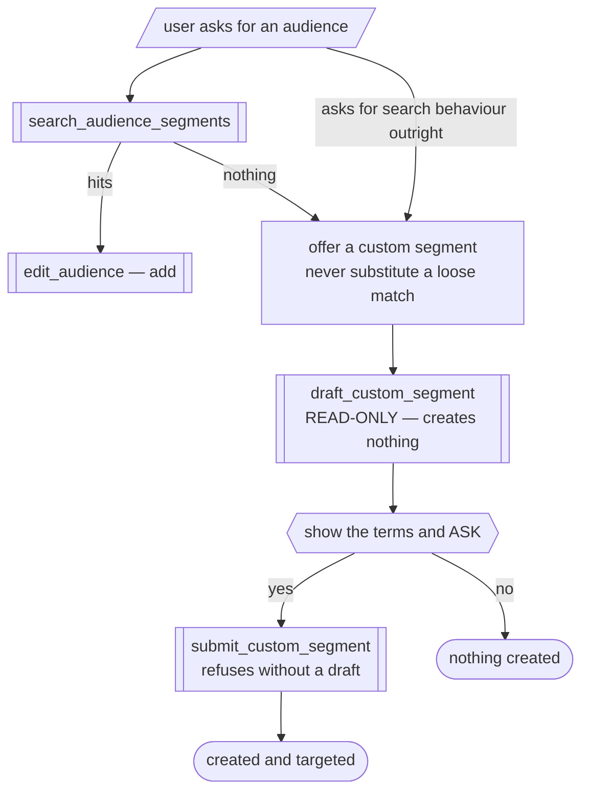
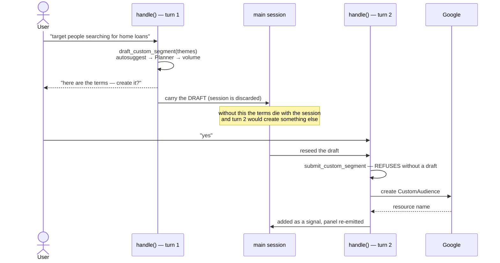

# Audience Agent

Chooses **who a campaign reaches**, then answers for that choice and changes it by
conversation. Where the keyword agent decides *what someone typed*, this one decides *who the
person is* — and they are not interchangeable: a Demand Gen campaign has no keywords at all,
so this agent is the only thing between a business brief and a targeted ad.

**Channel-neutral by design.** A Google `Audience` resource serves Demand Gen, Performance Max
and App campaigns, so the channel arrives as an argument and only decides which segments are
allowed to serve. Nothing here is named for one channel.

**Vocabulary — four levels that get conflated:**

| Term | Means | Where it lives |
|---|---|---|
| **segment** | one catalogue entry — an in-market category, life event, detailed demographic, custom segment or user list | `AudienceSignal.ref` |
| **dimension** | a group of segments, or one demographic filter | `Audience.dimensions[]` |
| **audience** | the single resource holding every dimension, attached to the ad group | `AudienceTargetingResult` |
| **signal** | our word for one chosen segment *plus why it was chosen* | `AudienceSignal` |



Segments **OR** within a dimension; dimensions **AND** across. That one sentence decides
whether a campaign reaches many people or almost nobody, and it is the fact most often got
backwards — splitting segments across dimensions *narrows* to an intersection.

---

## 1. The core idea

Google's catalogue is roughly a thousand entries, and a name alone is ambiguous.
"Construction" sits under a product category — people **buying** construction services — and
again under Employment, people who **work** in construction. Opposite audiences. Anything that
matches on names will confidently choose the wrong one.

So the agent does not pick from a list of names. It **loads the real catalogue**, reads each
entry's position in the tree, chooses with the ancestry in front of it, and records the
reason. Afterwards that record is what lets it answer *"why this one?"* without guessing, and
edit the set without rebuilding it.

Three structural facts shape every decision:

- **Broad across kinds, sharp within one.** Segments in a dimension are OR'd, so a second
  label for the same people widens the audience without adding anyone — but purchase intent,
  the life event that triggers it, and who the buyer is are *different* people, and naming
  only one of them leaves most of the market unreached. Optimized targeting expands from the
  selection as "an informed starting point", so near-synonyms get amplified loosely while a
  missing angle is simply never reached.
- **Exclusions are almost impossible.** `ExclusionSegment` has exactly one variant,
  `user_list`. "Exclude people interested in rentals" cannot be expressed, so the agent has to
  say so rather than quietly dropping it.
- **Some things are unreachable.** `custom_affinity`, `custom_intent` and `combined_audience`
  exist on `AdGroupCriterion` but have no `AudienceSegment` equivalent — in grouped mode they
  do not exist at all.

> **One line for a reviewer:** it reasons over the real catalogue with the tree in view and
> records why it chose what it chose — so the agent that built the audience is the one that
> defends it.

---

## 2. Two modes, one class

Two configured singletons, so neither mode sees the other's instructions or tools.

| | **build** (`suggest`) | **manage** (`handle`) |
|---|---|---|
| runs | once per campaign, headless | per user message, panel already on screen |
| prompt | `BASE` | `BASE_MANAGE` |
| prose | swallowed — the panel is the output | forwarded — the prose *is* the answer |
| tools | fetch · search · submit_segments · submit_demographics | search · lookup_segment · edit_audience · draft/submit custom segment |

The submit tools are deliberately absent from manage mode: they replace a set wholesale, which
would fabricate rationales for segments the model never re-derived and clobber a panel click
made in parallel. Manage edits go through `edit_audience`.

---

## 3. End to end



Both sessions are throwaway. What survives is what the run hands back.

---

## 4. Inside the build run



### 4.1 Phases come from what the run produced

There is no step counter. `current_phase(state)` reads state: no segments means SELECT,
segments but no demographics means DEMOGRAPHICS, both means **done** — and a finished phase
stops being injected.

That matters. Re-asking a finished step invites a compliant model to answer it twice, and a
second `submit_demographics` with no arguments would overwrite the narrowing it just recorded.
Deriving the phase also means a retry or a resumed session lands in the same place, rather
than depending on a counter that may not have survived.

### 4.2 What the run refuses to do

- **Invent an id.** Every submitted ref is checked against what was fetched. An invented one
  reaches nobody, or the wrong people, and nothing downstream would report it.
- **Pad to a number.** There is a soft floor, but a thin catalogue is a real answer for a niche
  business. A shortfall is reported, never filled with near-misses.
- **Substitute a loose match.** If the catalogue has nothing, it says so — and offers a custom
  segment instead.

---

## 5. The record — how "why?" is answerable

Each signal carries its `rationale` and its `path`, which answer the two questions users
actually ask:

- *"Why is this here?"* → the rationale, in the agent's own words at the time.
- *"Who does this actually reach?"* → the ancestry, which is what disambiguates the name.

`lookup_segment` answers from that record, and says plainly when there is none rather than
inventing a past reason — "we did not pick it" is usually "it was not the sharpest fit", not a
judgement worth reconstructing.

---

## 6. The manage flow

The main agent is a **pure router**: it forwards the verbatim message and does not answer
audience questions or classify the request. The agent that recorded the reasons is the one
that has them.

Each turn builds a fresh session holding its **own copy** of the audience, seeded with the
catalogue and a short window of prior exchanges, and hands the edited audience back when the
turn ends — including when the turn later fails, since edits already applied are real and the
user has already seen them in the panel.



The copy matters: the build envelope's writer copies on write, so a shared reference would
carry the first edit and then silently stop propagating.

### 6.1 Catalogue first; emptiness is the signal



The agent never classifies "is this a custom-segment request" — the catalogue answers or it
does not, and *that* decides. Which is true to the mechanism: custom segments exist precisely
because the taxonomy does not cover everything.

### 6.2 Custom segments

A custom segment reaches people by **what they search**. Building one is split in two so the
user's confirmation sits between the halves **structurally**, not by good behaviour: a real
resource in their account can never be created on the turn they merely asked about it. The
draft is spent on use, so a second "yes" cannot silently duplicate.

⚠️ **A custom segment can only be CREATED through chat**, and the two halves land in
*different turns* — so the drafted terms ride back to the main session between them. The user
confirms the exact terms they were shown, not a re-derived set.



The panel shows a created segment and can **untarget** it, but its `add` searches Google's
catalogue — where a custom segment by definition is not. Creating one needs two steps over
real terms and an explicit yes, which a single click cannot express. Untargeting is also not
deletion: the resource stays in the account and is reused by name next time.

Terms come from the **agent's own phrasings** — the user's words first, then how real people
would type the same intent — expanded through autosuggest and then the Keyword Planner, which
expands again and returns volume. Zero-volume terms are dropped: a term nobody searches
reaches nobody.

⚠️ Google's published limits are enforced **here, not by the API**. `validateOnly` on
`customAudiences:mutate` accepts an over-length keyword and even zero members, so a
"validated" payload can still target something we did not mean.

---

## 7. Invariants

These hold whichever path a change arrives by — panel click, spoken edit, or the build itself.

| Invariant | Why |
|---|---|
| One mutation path (`apply_edit`) | a spoken edit cannot break something a click could not |
| Dimension groups partition the positives | a ref in no group is silently untargeted; in two it ANDs and narrows to an intersection |
| Only user lists can be excluded | anything else is not expressible, and accepting it would drop it at emit |
| The last positive cannot be removed | grouped mode has no untargeted fallback — an ad group with no segment cannot run |
| An opaque ref is re-resolved, never trusted | a ref carries no label, kind or ancestry, and a stored snapshot cannot re-check that it still serves |

---

## 8. What the user sees

The panel groups signals by **kind**, because "buying this" and "into this" reach different
people and the user needs that distinction to choose. Each row carries its ancestry as a
breadcrumb, and exclusions get their own section since only user lists can be there at all.

| | panel | chat |
|---|---|---|
| catalogue segment — add | yes, via search | yes |
| catalogue segment — remove | yes | yes |
| **custom segment — create** | **no** (§6.2) | yes |
| custom segment — untarget | yes | yes |
| demographics | yes | yes |
| "why is this here?" | — | yes |

The agent is shown the catalogue as an indented **tree** — it is navigating a thousand entries
and structure helps it. The panel gets a **flat list**, because a handful of chosen segments
spread across branches is a list, not a tree.

---

## 9. File map

| File | Holds |
|---|---|
| `agent.py` | the two singletons, `suggest`, `handle`, the phase hook |
| `context.py` | base prompts and the phase machine |
| `tools.py` | the build tools |
| `manage_tools.py` | lookup and edit |
| `custom_segment.py` | draft and submit |
| `catalogue.py` | the targetable catalogue — one loader for every caller |
| `models.py` | signals, demographics, the result, and the limits the API will not enforce |
| `constants.py` | Google's published limits, then our own guards — kept apart on purpose |

Outside this package: `adapters/google/audience_taxonomy.py` (fetch + cache),
`adapters/google/custom_audience.py`, `tools/google/audience_targeting.py` (the build tool),
`tools/google/audience_update.py` (the shared mutation), `tools/audience_management.py` (the
router), `craft.py` (the panel).

---

## 10. Tuning

`constants.py` separates **Google's limits**, which are fixed, from **our guards**, which are
chosen and expected to move with campaign results. `MAX_SIGNALS_PER_KIND` is a ceiling, not a
target — and because optimized targeting expands past whatever is selected, **the agent should
never be judged by how many segments it returns.**

A reasoning model at the balanced tier: choosing an audience is judgement, not lookup. Turns
are bounded at eight — load, select, narrow is three calls, and the rest is room to search and
revise.


---

## 11. Measured live, 2026-08-17

Four runs against a real account (SOBHA, luxury real estate, IN). What the numbers settled, so
nobody re-derives them from guesswork.

### The catalogue

`1054 targetable segments · 31,717 chars · depths {1:54, 2:255, 3:335, 4:187, 5:208, 6:15}`

The tree is **~8k tokens and ~85-90% of this agent's context** — base prompt plus business
brief is only ~1.7k. So it is the only thing here worth optimising, and prompt wording is noise
by comparison.

⚠️ **Do not prune the tree by depth.** 39% of it sits at depth 4-6, and the segments the agent
actually picked were at **depth 5** (`Real Estate > Residential Properties > Residential
Properties (For Sale) > Apartments (For Sale) > New Apartments (For Sale)`). Cutting to depth 3
would remove exactly the winners. The instrumentation line in `tools.py` exists to keep this
answerable with data rather than intuition.

Two cuts that were worth making: kind as a **heading rather than a per-line suffix** (−28%), and
refusing a **second `fetch_audience_segments`** — every live run called it twice, and the
catalogue is 24h-cached, so the duplicate was a second full tree in history for nothing.

### The trap that cost a whole run

`ToolResult.data` **does not reach the model**. `to_tool_result_content()` reads
`model_summary or summary`, and falls back to `data` only when *both* are empty:

```python
primary = self.model_summary or self.summary
text = primary or _data_text(self.data)
```

Both discovery tools set `summary`, so the tree and the search hits were computed, stored, and
silently dropped. The agent received `"1054 targetable segments available."` — a count with no
ids — reasoned in circles for 42 calls, and returned `segments=0`.

**Anything the model must read goes in `model_summary`.** Unit tests asserting on `res.data` or
on session state pass right through this; assert on `to_tool_result_content()`.

### The naming collision that lost a segment kind

The agent skipped **every** `DETAILED_DEMOGRAPHIC` segment, reasoning:

> *"DETAILED_DEMOGRAPHIC: We'll handle in next step with submit_demographics."*

It is not the same thing. Those are **segments** (OR'd, add reach) and belong to
`submit_segments`; the demographics phase is `AudienceDimension` (AND'd, removes reach) and
cannot carry them. By the time it looked, the segment step had closed — and a segment never
submitted is indistinguishable from one deliberately rejected.

Both prompts now say so explicitly. The panel calls the filter section **Demographic Filters**
for the same reason: Google reuses the word for two opposite mechanisms, and "parental status"
exists in both.

### Breadth

"Pick the smallest set" produced **3 segments, zero Affinity** — the agent had considered
mortgage intent and four affinity segments and discarded them as instructed. Rewritten to
*breadth across kinds, sharpness within one*, it produced **8 across three kinds** while still
dropping near-synonyms (Luxury Fashion Buyers as overlapping Luxury Shoppers).

Cost: `41,976 → 62,760` tokens. That is reasoning, not context — the tree did not grow.
