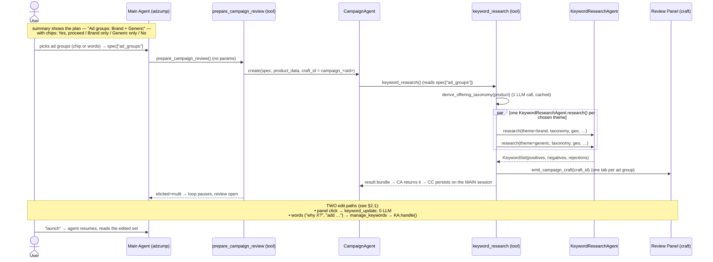
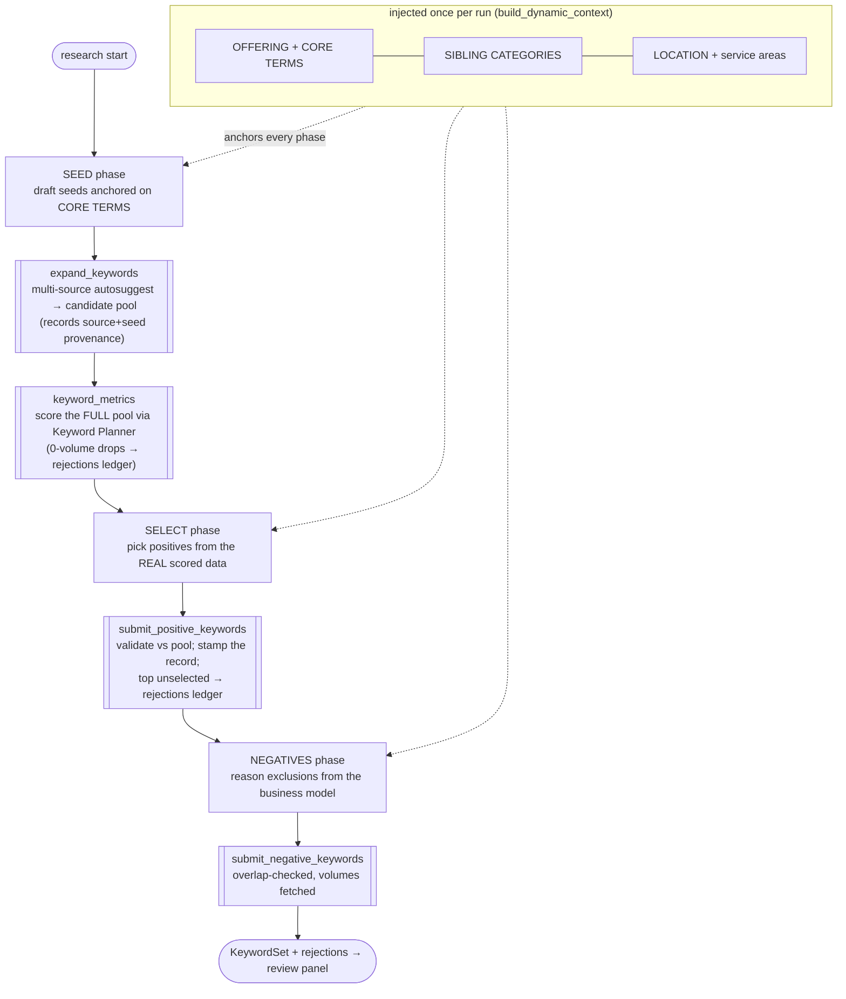
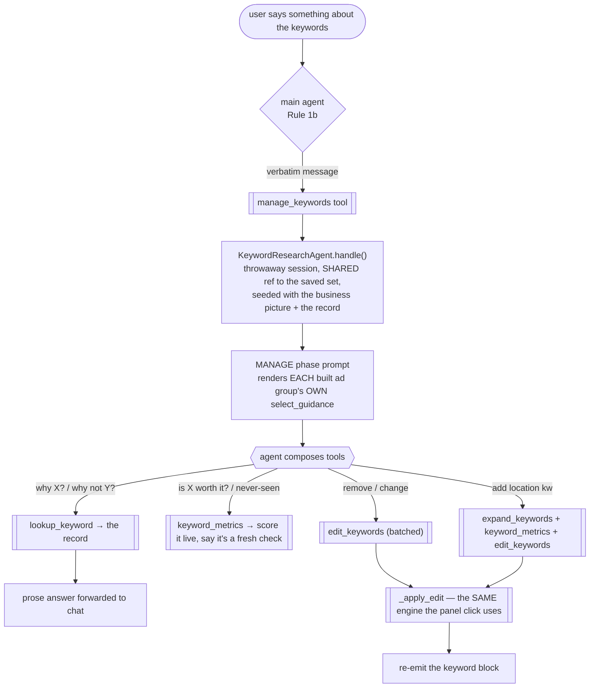

# Keyword Research Agent

Keyword research **and** post-research answering/editing for **Google Search** campaign
creation. One agent owns the whole keyword lifecycle: it **generates** an ad group's
keywords, records **why** each was chosen or skipped, then **answers questions** about them
and **edits** them by conversation. This doc covers the whole path — from the main adzump
agent down to the keyword agent's tool loop — what each piece does, how it differs from the
legacy Adzump-AI flow, how to read the run logs, and the design decisions a reviewer will ask
about.

**Vocabulary (three distinct levels — do not conflate):**

| Term | Means | Where it lives |
|---|---|---|
| **ad group** | what the USER picks and what Google creates (holds keywords + ads + audiences) | `campaign_spec["ad_groups"]`; the future mutation layer's `AdGroup` |
| **keyword theme** | the *keyword strategy* for one ad group — seed/select/negative guidance + policy flags. Brand and Generic today; Generic-Location / -Amenities / -Price next | `themes.py` (`KeywordTheme`) |
| **funnel** | the *buyer's* research journey (`includes_informational_funnel`) — unrelated to the above | `taxonomy.py` |

Today: one theme per chosen ad group, 1:1 by id, so `get_theme(ad_group_id)` is the seam. A
theme owns **only** the keywords; ads and audiences attach to the ad group later.

> **Why two names (`ad_groups` in the spec, `themes` in the result).** They are two levels,
> deliberately kept distinct. The user chooses **ad groups** — the Google Ads container — so
> that's what `campaign_spec["ad_groups"]` holds and what the consent chips set. Each ad
> group's *keywords* come from a **keyword theme** (the strategy), which is what the result is
> keyed by (`KeywordResearchResult.themes`); `_resolve_themes(spec)` is the seam that maps one
> to the other. Keeping them separate leaves the name `AdGroup` free for the real container
> when ads / age / gender land (those attach to the ad group, not to a keyword strategy) —
> collapsing them into one name is exactly what would force a rename then. (An earlier draft
> called a theme a *funnel*; renamed because `funnel` already meant the buyer's journey —
> `funnels` / `FunnelSpec` no longer appear in the code.)

---

## 1. The core idea

The legacy flow was a **fixed, linear service**: one function generated seeds, the next
fetched suggestions, the next selected positives, the next generated negatives — each a
separate LLM call against a static prompt file. The model never saw the real Google data
while deciding; it couldn't adapt, re-query, or catch when its seeds had drifted into the
wrong product category. And once it finished, it was **done** — it kept no record of its
decisions, so nothing downstream could explain a choice or edit the set intelligently.

The new flow is an **agentic ReAct loop with a memory**. One `KeywordResearchAgent`:

1. **Generates** — drives research through tools, reasoning over **real Planner
   volume/competition as it goes**, and records the *reason* behind every pick and every
   pass-over.
2. **Answers** — after generation, explains "why is X here?" / "why isn't Y?" **from that
   record**, not from a guess.
3. **Edits** — adds / removes / changes keywords by conversation, through the **same
   validated mutation engine** the review panel's clicks use.

A small base prompt plus a per-turn **phase** prompt keeps each step focused; a
business-agnostic **context layer** (the offering taxonomy) anchors every run so it works for
*any* business without hardcoded category rules.

> **One line for a reviewer:** we replaced a blind, fixed pipeline with a data-aware agent
> that records why it decided what it did — so it can generate, explain, and edit through one
> set of tools and one set of invariants, with no per-question handlers.

---

## 2. End-to-end flow (main agent → keywords → panel)



**Why three agents?** Each layer has one job and stays swappable:

| Layer | Responsibility | Lives in |
|---|---|---|
| **Main agent** (`adzump`) | Collects + confirms details; shows the **ad-group plan** and captures the user's choice; routes keyword questions/edits to the keyword agent | `agents/adzump/agent.py`, `next_action.py`, `prompt_sections.py` |
| **`prepare_campaign_review` tool** | Spawns the `CampaignAgent`, persists its result on the main session | `tools/prepare_campaign_review.py` |
| **`CampaignAgent`** | Platform-agnostic shell — runs the chosen platform's creation tools (Google Search → `keyword_research`). New platforms/channels slot in here | `agents/campaign/agent.py` |
| **`keyword_research` tool** | Resolves which ad groups the user chose (`_resolve_themes`), derives the taxonomy, resolves geo/location, runs the chosen themes **in parallel**, emits the craft | `agents/campaign/tools/google/keyword_research.py` |
| **`KeywordResearchAgent`** | The agentic loop. `research()` = generate one theme; `handle()` = answer/edit an existing set | `agents/campaign/google/keyword/agent.py` |
| **`manage_keywords` tool** | Main-agent router → `KeywordResearchAgent.handle()`; forwards the user's verbatim words | `tools/keyword_management.py` |

### The consent step — the user picks the ad groups (Google only)

The confirm step already runs `present_options("Proceed to build the campaign?")`, so the
ad-group plan **rides that same prompt** — no extra turn. The summary ends with a
`- **Ad groups**: Brand + Generic` line and the chips become
*Yes, proceed / Brand only / Generic only / No, make changes*, captured into
`spec["ad_groups"]` (`field="ad_groups"`; `set_campaign_spec` also accepts the spoken form,
"no, only brand"). The model **doesn't** pick — `keyword_research` has no `keyword_type`
param; it reads the user's choice via `_resolve_themes(spec)`, which normalises whatever
lands (chip label / CSV / list / nothing → the full plan we showed).

**Gated to Google.** Meta targets audiences in ad sets and has no keywords, so a Meta run is
never asked the ad-group question (`next_action.py` gates on `cctx.is_google`).

### 2.1 Review & edit — two paths, split by the *kind* of edit

After the panel opens, `prepare_campaign_review` returns `elicited=True,
elicit_expects="multi"` — the main-agent loop **pauses** there instead of barrelling to
launch. Edits then flow down **one of two paths**, chosen by what the edit *is*:

| The edit is… | Path | Cost | Why |
|---|---|---|---|
| a **mechanical panel click** (delete a row, flip a match type) | `router.py` sniffs the widget JSON → `stream_keyword_widget` (`api.py`) → `update_keywords` (`keyword_update.py`) | **0 LLM** | a plain set mutation; an LLM turn per click would be slow and costly |
| **words** ("why is X here?", "add location keywords", "drop the low-volume ones") | main agent Rule 1b → `manage_keywords` → `KeywordResearchAgent.handle()` | 1 agent turn | needs judgement, the record, or new real keywords — the keyword agent owns all three |

Both paths mutate the **same** `session_ctx["keyword_research"]` through the **same**
`_apply_edit` engine (see §5), so a spoken edit can never break an invariant a click
couldn't. The launch step, when it comes, reads the already-edited set from the session —
edits are honoured without the agent re-enumerating them.

**How this relates to the location agent.** The location sub-agent runs *every* geo edit
(even a map click) through its own LLM loop. Keywords instead keep the 0-LLM fast path for
mechanical clicks **and** route spoken edits to the agent — the best of both, split by edit
kind. The tradeoff is honest: keyword edits are many and simple (pruning a long list), so a
click stays free; but a *spoken* keyword request is exactly where the agent's record and
tools earn their turn. Location edits are few and complex, so one pattern (always the agent)
is right there.

### 2.2 Persistence & the volume-freshness tradeoff

`keyword_research` lives in `session_ctx` — persisted **with the session** (survives reload),
not in the durable per-business store (`AISuggestedData`, which holds product / asset /
location / competitive data). This is deliberate, because of what the volume number is.
`avgMonthlySearches` (from the Planner's `generateKeywordHistoricalMetrics`) is, per Google's
docs, the **average monthly searches over the trailing 12 months, recomputed monthly** — the
window rolls forward each month (`monthly_search_volumes` carries the 12 per-month points),
reported for exact-match + close variants regardless of the campaign's match type, and
rounded. A stored snapshot therefore drifts month-over-month, so durably caching it would
surface stale numbers.

- **Volumes** — never durably cached; fresh on each research run (idempotent within a session
  via `_research_key`). `volume_at_pick` is kept on each positive precisely because the live
  `volume` drifts (see §4).
- **The curated set + its reasons** is the durable *decision*. It lives on the **main
  session** (`session_ctx["keyword_research"]`), which is what makes edits and "why" possible
  without reconnecting the throwaway generation session (see §5). If pre-launch cross-session
  resume is ever required, store the **set** and **re-fetch volumes on load**.
- **At launch** (future) — snapshot the as-launched set (+ volumes at that time) as an audit
  / optimization baseline; Google Ads becomes the live source of truth after.

Sources: [Planner historical metrics](https://developers.google.com/google-ads/api/docs/keyword-planning/generate-historical-metrics)
· [About Keyword Planner metrics](https://support.google.com/google-ads/answer/3022575).

---

## 3. Inside the keyword agent — GENERATION (one run = one theme)

`research()` seeds a **throwaway** sub-session and drives the loop. The base prompt is small;
**`build_turn_reminder` injects only the current phase's guidance** based on progress
(seed → select → negatives). Which phase is a pure function of which `kw_*` keys exist yet, so
the phase machine is coupled to the tools' own side effects, not a stored cursor.



**The amplification chain (why seed quality matters most):** good seeds → good autosuggest
expansion → more/better Planner ideas → more relevant selections. Seeds are the richest
prompt of the set for exactly this reason.

**The seven tools** — five for generation, two for management (§5). All thin wrappers; all
judgment stays in the agent's reasoning:

| Tool | Phase | Does |
|---|---|---|
| `expand_keywords` | generate + manage | Fans seeds across Google / Bing / DuckDuckGo (+ YouTube when informational) autosuggest → real searched phrasings; records `{keyword: (source, seed)}` provenance |
| `keyword_metrics` | generate + manage | Scores the pool through the Keyword Planner (real volume / competition / CPC) — the relevance gate. **Recovers** clean candidates the expansion misses (§3.2); records 0-volume drops. In manage it keeps 0-volume candidates too, so an add the user asked for isn't silently dropped — the per-ad-group bar decides |
| `fetch_more_candidates` | generate | Pages through lower-volume scored candidates |
| `submit_positive_keywords` | generate | Validates picks against the scored pool, stamps the record (§4), logs the top unselected |
| `submit_negative_keywords` | generate | Records negatives, fetches their volumes |
| `lookup_keyword` | manage (§5) | Reads the record for one keyword — in-set / passed-over / unseen |
| `edit_keywords` | manage (§5) | Adds / removes / changes keywords through the shared engine |

Generate and manage are **two configured instances of the same class** (§5): the generate
instance carries the build prompt + the top five tools, the manage instance its own prompt +
`expand`/`metrics`/`lookup`/`edit`. `expand_keywords`/`keyword_metrics` appear on both.

**LLM proposes, the tool layer disposes.** Every keyword the model emits passes deterministic
gates it can't skip: keyword normalisation + length, match-type/intent coercion,
**cross-business → PHRASE** enforcement (`models.py`), candidate-membership on positives, and
a **token-overlap drop** on negatives that collide with positives (`tools.py`). A bad model
turn can't produce an unsafe or self-conflicting set. The submit tools — which rebuild a set
wholesale, right for a build and destructive for an edit — live **only on the generate
instance**, so an edit run can't reach them at all (§5).

### 3.1 Negative match types (phrase / broad — never exact)

Negatives exclude a *concept*, so the agent picks **phrase** or **broad**, never **exact**. Exact is
the narrowest — it blocks only the literal query and lets every longer variation leak through, so it
barely excludes anything. Google's own "running shoes" example ([match types][neg-mt]):

| Search query | neg **broad** `running shoes` | neg **phrase** `"running shoes"` | neg **exact** `[running shoes]` |
|---|:---:|:---:|:---:|
| `running shoes` | blocked | blocked | blocked |
| `blue running shoes` | blocked | blocked | **shows** |
| `shoes running` | blocked | shows | shows |
| `buy running shoes online` | blocked | blocked | **shows** |

So **phrase** (default) blocks the term plus anything containing it in order; **broad** blocks a
search with all the words in any order (multi-word concepts whose order varies). The schema
(`submit_negative_keywords`) and the validator (`_coerce_negative_match_type`, `models.py`) allow
only these two — a stray `exact` is coerced to phrase.

[neg-mt]: https://support.google.com/google-ads/answer/2453972

### 3.2 Candidate recovery (why `keyword_metrics` calls two Planner APIs)

`generateKeywordIdeas` (the expansion) is powerful but has two failure modes: it caps how
many seeds we can send (the overflow is discarded) and it occasionally returns **duplicate-token
junk** (`prescription glasses prescription` instead of `prescription glasses`) — so a real head
term can be absent from the scored pool. `keyword_metrics` closes both gaps with a second,
cheaper API — `generateKeywordHistoricalMetrics` (exact scoring, **no** re-expansion, no
mangling) — over two feeds:

1. **Overflow** — the real autosuggest queries beyond the expansion cap (otherwise thrown away).
2. **De-mangled repairs** — for any idea with a repeated token, the order-preserving collapsed
   form (`_collapse_repeats`).

Both are scored exactly and kept **only if they have real volume**, then merged into the pool
(dedup, keep highest volume). Two safeguards make this incapable of corrupting data: every
recovered form is **validated against Google's own volume** (a bad collapse scores ~0 and is
dropped), and the **original is never dropped** — recovery only ever *adds* a clean candidate.
Misspellings are single tokens, never repeats, so they're never touched.

### 3.3 Why there's no critic / repair pass (considered, prototyped, removed)

We considered a **review-then-repair** pass over the selected set — and actually prototyped a
deterministic "floor" version — but **removed it**: a live trace showed it was solving a problem
the recovery step already solves. With a clean pool, the model selects the real head on its own
and skips the mangled twins; the prototype only **re-injected the mangled forms the model had
correctly avoided**.

> **When an LLM critic would earn its place:** only if future live runs show the draft is
> genuinely and repeatedly inconsistent in a way the phase prompts can't fix — then a critic is
> justified with *evidence, not on spec*.

---

## 4. The record — how "why?" is answerable

The old flow kept only the final set; every reason was lost the moment generation ended. The
new flow records the decision, not just the outcome — so the agent (§5) answers from what
actually happened rather than re-deriving a plausible story.

**Why a keyword IS here** — stamped on each `OptimizedKeyword` at `submit_positive_keywords`:

| Field | Source | Note |
|---|---|---|
| `rationale` | LLM | its one-line why |
| `admitted_by` | LLM | *which* select rule let it in ("core term in served area", "brand name — mandatory") |
| `source_seed` | **computed** | the seed that surfaced it (`""` when the Planner generated it, not autosuggest) |
| `volume_at_pick` | **computed** | the volume the decision was made on — kept because `volume` drifts monthly (§2.2) |

`source_seed` is only recoverable because `fetch_suggestions` now returns
`Suggestion(keyword, source, seed)` and `expand_keywords` stashes first-seen provenance in
`kw_provenance` — provenance is **recorded, never asked of the model** (it cannot know which
surface found a term).

**Why a keyword is NOT here** — the `rejections` ledger on each `KeywordSet`
(`Rejection(keyword, rule, volume_at_eval, reason)`):

| rule | Recorded where | Cost |
|---|---|---|
| `not_selected` | `submit_positive_keywords` — the top-volume candidates the model scored but didn't pick | **free** — `kw_candidates` is already volume-sorted, so the top unselected *are* the terms users ask about |
| `zero_volume` | `keyword_metrics` — dropped by the theme's demand gate instead of vanishing silently | free |

The model may also pass an optional `rejected: [{keyword, reason}]` naming a *few* deliberate
near-misses; those reasons merge onto the computed rows. Capped at
`MAX_REJECTIONS_RECORDED` (rides the session, not a DB).

**The honest limit:** you cannot record why you never *thought* of something. A keyword that
was never a candidate has no recorded reason — the agent must say so and, if asked for a
judgement, score it live and make clear that's a fresh check (§5).

---

## 5. The MANAGE flow — answer & edit after generation

Once a set exists, the same agent answers questions and makes edits. This is a **genuine
agent**, not a workflow: no script, a goal, observable state (the record), and general tools
it composes. The autonomy boundary is deliberate — generation is a scripted workflow (the
phase machine *guarantees* negatives always run, on a path that spends real money); the
open-ended question/edit space is where self-direction belongs.



**`handle()` mirrors the location agent's `handle()`**, with two differences that matter:

- **Shared refs, not a copy.** The throwaway session is seeded with a *reference* to the
  parent's `keyword_research` dump (exactly as the location sub-session shares
  `product_data`), so `edit_keywords` writes through to the saved set instead of dying with
  the run. Nothing is reconnected — **the record, not the session, is the durable thing.**
- **A passthrough stream.** Generation's `_ReviewStream` swallows prose (only the lifecycle
  card surfaces); an *answer* IS prose, so `handle()` uses `_ManageStream` which forwards
  `emit_text` to the parent.

`handle()` seeds the **business picture, not a keyword-shaped slice** —
`brief.conversation_text` adds competitors + budget on top of the offering, because a question
can be "are we covering what competitors bid on?" as easily as "why this keyword?". The seed
builder (`brief.py`) is **shared** by `research()` and `handle()` so what the agent knows
can't drift between them.

**Two configured instances, one class.** `get_keyword_research_agent()` and
`get_keyword_manage_agent()` are separate singletons of `KeywordResearchAgent`: the first pairs
the generation prompt (`BASE`) with the five build tools; the second pairs a manage-only prompt
(`BASE_MANAGE`) with `expand`/`metrics`/`lookup`/`edit`. Neither mode ever sees the other's
system prompt or tools. This is what makes the submit tools **structurally** unreachable during
an edit — there's no runtime guard to forget, because the manage agent simply doesn't have them.
Per-turn dynamic context (which ad groups, which bars) still keys on the session's `kw_mode`,
set by `handle()`.

**One mutation engine, two callers.** `_apply_edit` (in `keyword_update.py`) is the single
add/delete/edit path. The panel's `update_keywords` (1 item, 0 LLM) and the agent's
`edit_keywords` (batched, N items) both call it, so **the agent physically cannot make an edit
a click couldn't** — same "a keyword can't be a positive in two ad groups" rejection, same
EXACT→PHRASE coercion. Edits are **incremental**, never a wholesale re-submit — a re-submit
would fabricate provenance on rows the model never re-derived and clobber a concurrent panel
click, which is exactly why the submit tools are absent from the manage instance.

**The rulebook closes the loop.** A manage session spans *every* built ad group (lookup reads
all, edit targets any), so the framing does too: `build_dynamic_context` lists all ad groups,
and the MANAGE prompt renders **each built ad group's own `select_guidance`** — the *same*
policy strings the sets were built with — so an addition to any ad group must clear the bar it
was built with. The standard can't drift, because it's the same string rendered into both the
build and the edit. (`kw_sources` is likewise the **union** across the built ad groups, so a
manage-mode `expand_keywords` reaches the same surfaces — YouTube included — a fresh run would.)

**Routing.** `manage_keywords` (a main-agent tool, `tools/keyword_management.py`) exposes
**only `user_message`** — no structured params for the orchestrator to fabricate, same
discipline as `manage_targeting_locations`. **Rule 1b** in
`prompt_sections.py._how_to_respond_section` tells the main agent to route any keyword
question/edit here and **not answer it itself** (it didn't record the reasons; it would be
guessing).

**The falsifiable test (the acceptance bar):** if any of these needed its own handler, this
would be a pile of handlers, not an agent. **None do** — each is composed from *state + the
tools + the theme's policy*:

| User says | How it's answered — no handler exists |
|---|---|
| *"why did you include affordable running shoes?"* | `lookup_keyword` → in-set record |
| *"why isn't cheap running shoes there?"* | `lookup_keyword` → ledger (`not_selected`, vol 4400) |
| *"why not blue running shoes?"* | `lookup_keyword` → no record → **says so** + `keyword_metrics` scores it live |
| *"add some keywords for the locations"* | `expand_keywords` → `keyword_metrics` → `edit_keywords` (the generic theme's seed guidance already carries the location mix) |
| *"include apartment generic keywords too"* | `apartment` is a recorded **sibling/negative** → surfaces the conflict instead of quietly breaking the campaign |
| *"remove all the low-volume ones"* | reads the set from the prompt → one batched `edit_keywords` |
| *"what's my total volume across brand?"* | sums the set already in the prompt — **no tool** |
| *"are we covering what competitors bid on?"* | competitors are in the seed (`conversation_text`) — answers from context |

---

## 6. The context layer — offering taxonomy

Product analysis doesn't persist a category/sibling taxonomy, so we **derive one once per
run** from the confirmed `product_data` (business_type, products/services, USPs, summary) via a
single balanced-tier LLM call (cached by an offering fingerprint, fail-soft). It yields:

- **`core_terms`** — what the business actually sells (anchor every seed here)
- **`sibling_categories`** — adjacent same-industry things it does *not* sell (→ negatives)
- **`is_location_specific`** — local/regional vs national/online (drives location anchoring)
- **`includes_informational_funnel`** — buyers research via how-to/educational content → adds **YouTube** autosuggest

The last signal drives **`BusinessProfile.source_names(theme_id)`** — which autosuggest
surfaces `expand_keywords` queries (web-search default: Google/Bing/DuckDuckGo; plus YouTube
only for the **generic** theme when the funnel fits — off-intent for brand). Data-driven per
run, so it works for any vertical without hardcoded rules.

This is what makes the agent **business-agnostic** — no hardcoded verticals, no
`business_scale` string-matching. An upsell-adjacent sibling (same buyer, adjacent budget —
e.g. *3 BHK villa* for a *3 BHK apartment* buyer) may be targeted as a deliberate
**cross-business PHRASE** positive; every other sibling stays a negative.

---

## 7. Reading the run logs (the funnel)

Each theme emits a clean, greppable funnel. To follow one: `grep "type=generic"`.

```
kw_expand type=generic seeds=60 autosuggest=445 pool=200 overflow=281
keyword_planner: scoring 200 candidates in 14 Planner call(s)
kw_metrics type=generic sent=200 planner_ideas=4793 recovered=123 scored_pool=600
kw_submit_positive type=generic submitted=15 kept=9 dropped=6
kw_submit_negative type=generic submitted=14 kept=14 dropped=0
keyword_research done type=generic positives=9 negatives=14
```

| Log line | Read it as |
|---|---|
| `kw_expand … pool=… overflow=…` | `pool` = top slice sent to the Planner's expansion; `overflow` = real autosuggest queries beyond the cap, scored later (not discarded) |
| `keyword_planner: scoring N … M call(s)` | the pool reaches `generateKeywordIdeas`; `M = ceil(N / 15)` calls |
| `kw_metrics … planner_ideas=… recovered=… scored_pool=…` | `planner_ideas` = what the expansion returned; **`recovered`** = clean terms rescued via historical metrics (§3.2); `scored_pool` = stored for selection |
| `kw_submit_positive/negative … submitted/kept/dropped` | model proposed → validated & kept → dropped (not in the scored pool / dupe / overlap) |
| `keyword_research done` | final counts that reach the panel |
| `kw_edit applied=… rejected=… themes=…` | a MANAGE-mode edit (§5): how many changes landed vs were rejected by the shared engine |

> Tip: the hundreds of `httpx … 200 OK` lines are httpx's own logger. Set
> `logging.getLogger("httpx").setLevel(logging.WARNING)` to collapse the log to just the
> `kw_*` funnel.

---

## 8. Old vs new at a glance

| | Legacy (Adzump-AI `GoogleKeywordService`) | New (`KeywordResearchAgent`) |
|---|---|---|
| Control flow | Fixed linear service | Agentic ReAct loop; agent decides each step, can re-query |
| Prompts | One static `.txt` per phase | Small base + **per-turn phase prompt** by progress |
| Sees real Planner data while deciding? | No — selection ran after, blind | **Yes** — reasons over live volume/competition |
| Expansion | Google Ads suggestions | **Multi-source autosuggest** (Google / Bing / DuckDuckGo / YouTube) |
| Business fit | Hardcoded / `business_scale` rules | **Derived offering taxonomy** — business-agnostic |
| A keyword = one theme | fixed brand/generic | **data-driven `KeywordTheme`** — a new ad group is one row |
| Records *why*? | No | **Yes** — `rationale`/`admitted_by`/`source_seed`/`volume_at_pick` + a rejections ledger |
| After generation | done | **answers + edits** through one shared mutation engine |
| Safety | In-prompt | **Deterministic gates** in the model + tool layer |
| Themes | Sequential | **Parallel**, independent (one failing still returns the other) |

---

## 9. File map

```
agents/campaign/google/keyword/
├── agent.py         KeywordResearchAgent — research() (generate) + handle() (answer/edit);
│                    two configured singletons (generate vs manage) — separate prompt + tools
├── themes.py        KeywordTheme + the registry; each theme's seed/select/negative guidance
│                    + policy flags (keep_zero_volume, requires_brand_token, …). ONE row per theme
├── context.py       BASE + BASE_MANAGE system prompts + the Phase machine (SEED/SELECT/NEGATIVES/MANAGE);
│                    phase_prompt() reads guidance off the theme; data-level import guard
├── tools.py         the 5 generation tools + deterministic gates + the rejections ledger
├── manage_tools.py  the 2 manage tools (lookup_keyword, edit_keywords)
├── brief.py         shared seed builder (business_text / conversation_text / resolve_location)
├── taxonomy.py      derive_offering_taxonomy — the business-agnostic context layer
├── models.py        KeywordSet / OptimizedKeyword / NegativeKeyword / Rejection + validators
└── constants.py     pool/seed/selection/rejection size knobs (see §10)

agents/campaign/                     CampaignAgent shell + keyword_research orchestrator tool
agents/campaign/tools/google/keyword_update.py   the shared _apply_edit engine (widget + agent)
adapters/autosuggest.py              multi-source autosuggest → Suggestion(keyword, source, seed)
adapters/google/keyword_planner.py   Keyword Planner (generateKeywordIdeas), chunked + breaker
tools/keyword_management.py          main-agent manage_keywords router → handle()
tools/prepare_campaign_review.py     main-agent entry that spawns the CampaignAgent
```

## 10. Tuning knobs (`constants.py`)

| Constant | Value | Meaning |
|---|---|---|
| `MAX_SEEDS` | 80 | seeds generated per theme |
| `MAX_SEEDS_TO_EXPAND` | 30 | top seeds fanned out to autosuggest |
| `MAX_EXPANSION_CANDIDATES` | 200 | pool sent to the Planner (caps API calls) |
| `MAX_STORED_CANDIDATES` | 600 | scored ideas kept (Planner expands beyond input) |
| `TARGET_POSITIVE_COUNT` | 30 | positives target per theme |
| `MAX_NEGATIVE_COUNT` | 40 | negatives kept per theme |
| `MAX_REJECTIONS_RECORDED` | 50 | "why not" ledger per rule (session-scoped, §4) |
| `_SEED_CHUNK_SIZE` (planner) | 15 | candidates per Planner call → calls = ⌈pool / 15⌉ |

---

## 11. LLM provider

The agent's **tool-use loop** runs on **OpenAI** today (`PROVIDER = "openai"` in `agent.py`)
through one abstraction — `app/services/llm_provider.py` → `get_llm_provider(name)`, an
`LLMProvider` ABC with a uniform tool-calling + streaming interface, implemented by
`AnthropicProvider`, `OpenAIProvider`, and `DeepSeekProvider`. The loop talks to the
**interface, never a vendor SDK**, so it switches at config level. The target must support
tool/function calling.

**The taxonomy step is the exception** — `taxonomy.py` makes a direct **AsyncOpenAI one-shot**
call in JSON mode (the sanctioned pattern for a self-contained inference), so it is
**OpenAI-only** and independent of `PROVIDER`.

**Billing for the one-shot.** A one-shot bypasses the loop, so it isn't auto-tracked. It's
still billed **per-agent** via `record_oneshot_usage` (core `session.py`), which records to the
currently-running agent's session with `record_token_usage` — the **same DB path the loop
uses**. `BaseAgent.run` publishes that session through the `current_session` contextvar, so no
session is threaded through tool contexts. The taxonomy call is thus attributed to the agent
that invoked it (`campaign`), not dropped or lumped onto the main agent.

---

## 12. Craft-panel focus (the two-craft rule)

This flow uses two crafts — the setup craft (`adzump_<session>`) and the campaign
keyword-review craft (`campaign_<session>`). To stop a trailing setup re-emit from stealing
the panel once `prepare_campaign_review` has opened the review:

- **UI** (`nocode-ui/.../Prompt/LazyPrompt.tsx`): a craft surfaces the panel only the first
  time its id is seen (`seenCraftIds` ref); later re-emits of a known craft update content in
  place without stealing focus. Generalizes to every multi-craft stage.
- **Backend** (`agent.py._on_loop_complete`): once `prepare_campaign_review` has begun
  (`campaign_craft_id` set), the end-of-turn hook stops re-emitting the setup craft.
