# Creative Agent Architecture

## Overview
The **Creative Agent** (`CreativeAgent`) is a specialized sub-agent within the Adzump ecosystem. Its sole responsibility is to handle the end-to-end process of generating, validating, and presenting ad creatives (images) for marketing campaigns.

## Folder Structure

```text
app/agents/adzump/agents/creative/
├── __init__.py
├── agent.py               # Core CreativeAgent loop and context builder
├── context.py             # Helpers for assembling the product profile context
├── image_agent.py         # Interfaces with the CreativeProvider (Gemini Imagen)
├── models.py              # Data structures (e.g., Creative dataclass)
├── selection.py           # CreativeSelectionAgent (vision-based base image selection)
├── tools.py               # Agent tools (create, edit, list creatives)
└── prompts/
    ├── creative_selection.txt  # Rules for selecting background images
    ├── image_layout.txt        # Prompt templates for image composition
    └── system.txt              # Core system prompt for the CreativeAgent
```

## Flow Diagram

```mermaid
sequenceDiagram
    participant User
    participant Main as AdzumpAgent (Parent)
    participant CA as CreativeAgent (Sub-agent)
    participant Vision as CreativeSelectionAgent
    participant ImageGen as Gemini Imagen Provider
    participant DB as Session Storage

    User->>Main: "Generate a square creative"
    Main->>CA: manage_creatives tool invoked
    
    rect rgb(30, 30, 30)
        Note over CA: Context Building
        CA->>CA: Extract Product Profile (Logo, Assets, Pricing, etc.)
    end
    
    alt Logo Missing
        CA-->>User: "Please upload your brand logo."
    else Logo Present
        CA->>Tools: Call create_creative()
        
        rect rgb(40, 40, 40)
            Note over Tools, Vision: Base Image Selection
            Tools->>Vision: Evaluate up to 10 scraped images
            Vision-->>Tools: Return best base image URL
        end
        
        Tools->>ImageGen: generate(prompt, logo_bytes, base_image)
        ImageGen-->>Tools: Generated Image Bytes
        Tools->>CDN: Upload image
        CDN-->>Tools: Image URL
        Tools-->>CA: ToolResult (image_url)
        
        CA-->>User: Renders markdown `![Creative](url){style="..."}`
        CA->>DB: Save session context (custom serialization)
    end
```



## Why We Did Each Thing

### 1. Sub-Agent Architecture
**Why?** Image generation is complex. It involves layout decisions, copywriting, aspect ratios, and visual evaluation. Putting this into the main `AdzumpAgent` would bloat its context limit and cause hallucinations. Delegating this to `CreativeAgent` keeps the main agent focused on campaign orchestration.

### 2. Vision-Based Selection Agent (`selection.py`)
**Why?** Websites contain dozens of images (logos, maps, blurry photos, hero shots). If we blindly pick the first scraped image as the background, the generated ad looks terrible. We introduced a separate `CreativeSelectionAgent` (using a fast vision model) to evaluate the top 10 scraped images against strict quality and composition rules before sending one to the image generator.

### 3. Strict Logo Requirements
**Why?** Image generation models (like Gemini) are prone to "hallucinating" text. If we don't provide an actual logo, the model tries to draw the brand name and inevitably misspells it. We added a strict rule in `system.txt` forcing the agent to halt and ask the user to upload a logo if one isn't found in the context.

### 4. Custom Session Encoder (`core/session.py`)
**Why?** Generated creatives are stored in the active session state as custom `Creative` dataclasses. Standard `json.dumps` destroys dataclasses by casting them to strings. We introduced a `custom_encoder` in the core session manager that correctly calls `.to_dict()` on our objects. This ensures that when the user refreshes the page, the creative data is seamlessly reloaded instead of crashing the UI.

### 5. Strict Markdown Styling (`{style="..."}`)
**Why?** When the agent outputs high-resolution landscape or portrait creatives, the React frontend renders them at full size, breaking the chat layout. We enforced a strict markdown constraint in the system prompt (`{style="width:250px;..."}`). This hooks natively into the frontend's Markdown parser, guaranteeing that all images are uniformly contained within thumbnail boxes.
