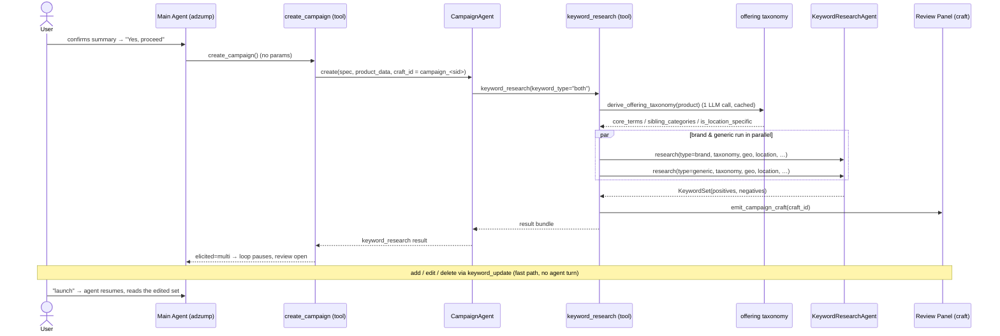
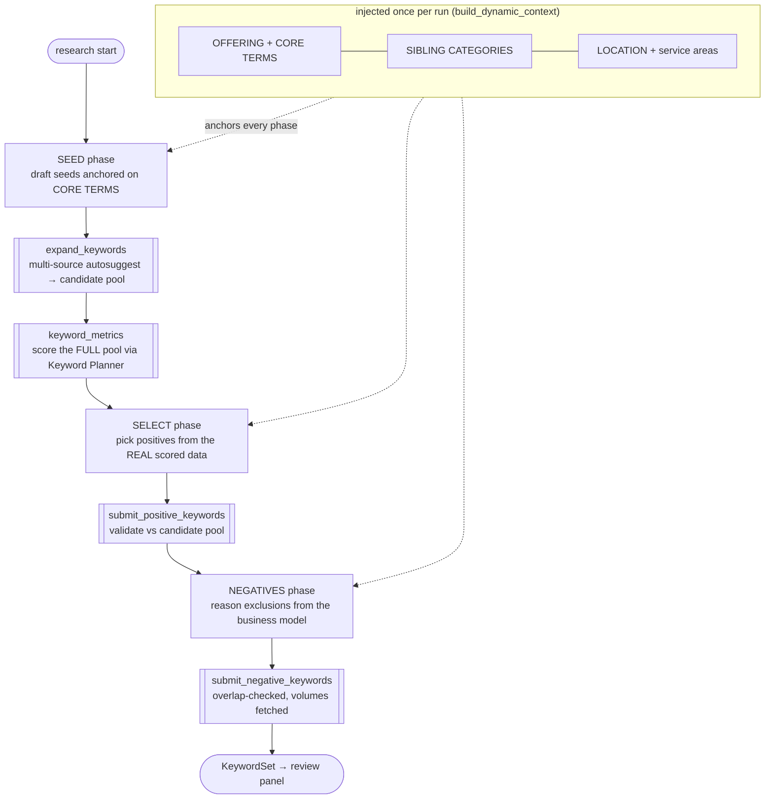
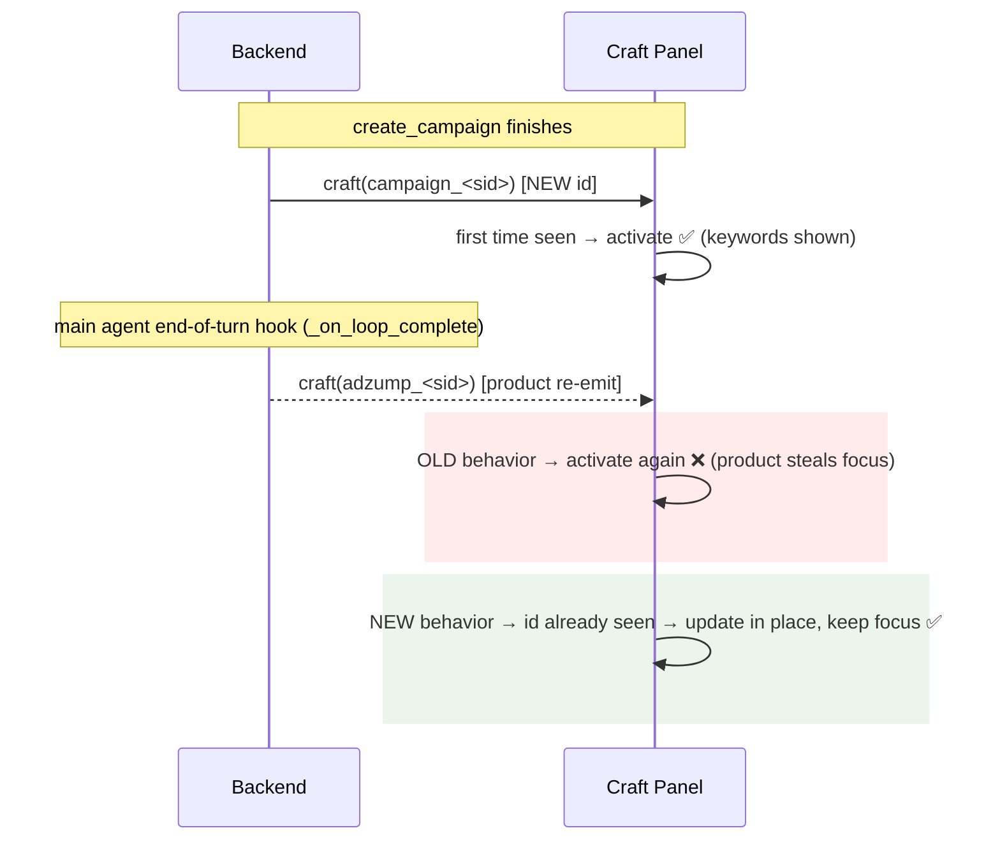

# Keyword Research Agent

Brand + generic keyword research for **Google Search** campaign creation. This doc
covers the whole path — from the main adzump agent down to the keyword agent's
tool loop — what each piece does, how it differs from the legacy Adzump-AI flow,
how to read the run logs, and the craft-panel issue we hit and fixed.

---

## 1. The core idea

The legacy flow was a **fixed, linear service**: one function generated seeds, the
next fetched suggestions, the next selected positives, the next generated negatives —
each a separate LLM call against a static prompt file. The model never saw the real
Google data while deciding; it couldn't adapt, re-query, or catch when its seeds had
drifted into the wrong product category.

The new flow is an **agentic ReAct loop**. One `KeywordResearchAgent` *drives* the
research through tools, reasoning over **real Planner volume/competition as it goes**.
A small base prompt plus a per-turn "phase" prompt keeps each step as focused as a
dedicated prompt, while the agent still decides what to do next and can loop. A
business-agnostic **context layer** (the offering taxonomy) anchors every run so it
works for *any* business without hardcoded category rules.

> **One line for a reviewer:** we replaced a blind, fixed pipeline with a data-aware
> agent + a derived business-context layer + deterministic safety gates.

---

## 2. End-to-end flow (main agent → keywords → panel)



**Why three agents?** Each layer has one job and stays swappable:

| Layer | Responsibility | Lives in |
|---|---|---|
| **Main agent** (`adzump`) | Collects + confirms campaign details; calls `create_campaign` | `agents/adzump/agent.py` |
| **`create_campaign` tool** | Spawns the `CampaignAgent`, persists its result for launch | `tools/create_campaign.py` |
| **`CampaignAgent`** | Platform-agnostic shell — runs the chosen platform's creation tools (Google Search → `keyword_research`). New platforms/channels slot in here without touching keywords | `agents/campaign/agent.py` |
| **`keyword_research` tool** | Derives the taxonomy, resolves geo/location, runs brand + generic **in parallel**, emits the craft | `agents/campaign/tools/google/keyword_research.py` |
| **`KeywordResearchAgent`** | The agentic loop for ONE type (brand or generic) | `agents/keyword/agent.py` |

### Review & edit — the elicitation model

When `create_campaign` shows the panel it returns `elicited=True, elicit_expects="multi"` — the
same primitive the asset-upload step uses. The main-agent loop **pauses** there instead of
barrelling to launch; `_pending_elicitation` records that a review is open.

Panel edits (`add` / `edit` / `delete`) post to `keyword_update` on a **separate fast path**
([`router.py`](../../router.py) `_stream_keyword_widget`) that mutates
`session_ctx["keyword_research"]` and re-emits the panel — **no LLM turn, nothing written to
chat history**. The agent isn't called per click.

The agent is called **once**, when the user sends a real message (e.g. "launch"): the elicitation
closes, `_resume_elicitation_section` steers it to acknowledge the edits and move to launch, and
`launch_campaign` reads the already-edited `keyword_research` from the session. So edits are honored
without the agent re-enumerating them. (See [`create_campaign.py`](../../tools/create_campaign.py)
and `agent.py._resume_elicitation_section`.)

---

## 3. Inside the keyword agent (one run = brand OR generic)

The agent's base prompt is small; **`build_turn_reminder` injects only the current
phase's prompt** based on progress (seed → select → negatives). So each turn reads
like a dedicated prompt, but a single agent drives and can loop.



**The amplification chain (why seed quality matters most):**
good seeds → good autosuggest expansion → more/better Planner ideas → more relevant
selections. Seeds are the richest prompt of the set for exactly this reason.

**The five tools** (thin wrappers; all judgment stays in the agent's reasoning):

| Tool | Does |
|---|---|
| `expand_keywords` | Fans seeds out across Google / Bing / DuckDuckGo autosuggest → real searched phrasings |
| `keyword_metrics` | Scores the pool through the Keyword Planner (real volume / competition / CPC) — the relevance gate. Also **recovers** clean candidates the expansion misses (below) |
| `fetch_more_candidates` | Pages through lower-volume scored candidates |
| `submit_positive_keywords` | Validates picks against the scored pool, records positives |
| `submit_negative_keywords` | Records negatives, fetches their volumes |

**LLM proposes, the tool layer disposes.** Every keyword the model emits passes
deterministic gates it can't skip: keyword normalisation + length, match-type/intent
coercion, **cross-business → PHRASE** enforcement (`models.py`), candidate-membership
on positives, and a **token-overlap drop** on negatives that collide with positives
(`tools.py`). A bad model turn can't produce an unsafe or self-conflicting set.

### Candidate recovery (why `keyword_metrics` calls two Planner APIs)

`generateKeywordIdeas` (the expansion) is powerful but has two failure modes: it caps how
many seeds we can send (the overflow is discarded) and it occasionally returns **duplicate-token
junk** (`prescription glasses prescription` instead of `prescription glasses`) — so a real head
term can be absent from the scored pool. `keyword_metrics` closes both gaps with a second,
cheaper API — `generateKeywordHistoricalMetrics` (exact scoring, **no** re-expansion, no
mangling) — over two feeds:

1. **Overflow** — the real autosuggest queries beyond the expansion cap (otherwise thrown away).
2. **De-mangled repairs** — for any idea with a repeated token, the order-preserving collapsed
   form (`_collapse_repeats`).

Both are scored exactly and kept **only if they have real volume**, then merged into the pool
(dedup, keep highest volume). Two safeguards make this incapable of corrupting data: every
recovered form is **validated against Google's own volume** (a bad collapse scores ~0 and is
dropped), and the **original is never dropped** — recovery only ever *adds* a clean candidate.
Misspellings are single tokens, never repeats, so they're never touched.

> **Deferred (pending review):** a mangled original and its clean twin both currently sit in
> the pool. We could drop the original **only when** its collapsed twin scored essentially the
> same volume (a strong "pure mangle" signal — `X X` 368k ≡ `X` 368k), while keeping both when
> volumes differ (`new york new york` ≠ `new york`). Safe de-clutter; left out of the first cut
> deliberately — implement after review if wanted.

### Why there's no critic / repair pass (considered, prototyped, removed)

We considered a **review-then-repair** pass over the selected set — and actually prototyped a
deterministic "floor" version — but **removed it**: a live trace showed it was solving a problem
the recovery step already solves. With a clean pool, the model selects the real head on its own
and skips the mangled twins; the prototype only **re-injected the mangled forms the model had
correctly avoided**. It turned out to overlap almost entirely with the de-mangle step above.

> **When an LLM critic would earn its place:** only if future live runs show the draft is
> genuinely and repeatedly inconsistent in a way the phase prompts can't fix — then a critic is
> justified with *evidence, not on spec*. A reviewer pass pays off when it grades many decisions
> at once; for a single keyword set on a clean pool, the model's own pass is enough.

---

## 4. The context layer — offering taxonomy

Product analysis doesn't persist a category/sibling taxonomy, so we **derive one once
per run** from the confirmed `product_data` (business_type, products/services, USPs,
summary) via a single balanced-tier LLM call (cached by an offering fingerprint, token
usage tracked, fail-soft). It yields:

- **`core_terms`** — what the business actually sells (anchor every seed here)
- **`sibling_categories`** — adjacent same-industry things it does *not* sell (→ negatives)
- **`is_location_specific`** — local/regional vs national/online (drives location anchoring)

This is what makes the agent **business-agnostic** — no hardcoded verticals, no
`business_scale` string-matching. An upsell-adjacent sibling (same buyer, adjacent
budget — e.g. *3 BHK villa* for a *3 BHK apartment* buyer) may be targeted as a
deliberate **cross-business PHRASE** positive; everything else sibling stays a negative.

---

## 5. Reading the run logs (the funnel)

Each type emits a clean, greppable funnel. To follow one type: `grep "type=generic"`.

A real generic run (Warby Parker, US), one line per stage:

```
kw_expand type=generic seeds=60 autosuggest=445 pool=200 overflow=281
keyword_planner: scoring 200 candidates in 14 Planner call(s)
kw_metrics type=generic sent=200 planner_ideas=4793 recovered=123 scored_pool=600
kw_submit_positive type=generic submitted=15 kept=9 dropped=6
kw_submit_negative type=generic submitted=14 kept=14 dropped=0
keyword_research done type=generic positives=9 negatives=14
```

| Log line | Read it as |
|---|---|
| `kw_expand … pool=… overflow=…` | `pool` = top slice sent to the Planner's expansion; `overflow` = real autosuggest queries beyond the cap, scored later (not discarded) |
| `keyword_planner: scoring N … M call(s)` | the pool reaches `generateKeywordIdeas`; `M = ceil(N / 15)` calls |
| `kw_metrics … planner_ideas=… recovered=… scored_pool=…` | `planner_ideas` = what the expansion returned; **`recovered`** = clean terms rescued via historical metrics from the overflow + de-mangled repairs (kept only if they have real volume — see §3); `scored_pool` = stored for selection |
| `kw_submit_positive/negative … submitted/kept/dropped` | model proposed → validated & kept → dropped (not in the scored pool / dupe / overlap) |
| `keyword_research done` | final counts that reach the panel |

> On this run `recovered=123` is the de-mangle/overflow step doing its job — that's how the clean
> `prescription glasses` (368k) reached the pool and got selected, instead of only the mangled
> `prescription glasses prescription` the expansion returned. (There is **no** critic/repair line
> in the funnel — that was considered and removed; see §3.)

> Tip: the hundreds of `httpx … 200 OK` lines are httpx's own logger. Set
> `logging.getLogger("httpx").setLevel(logging.WARNING)` to collapse the log to just
> the `kw_*` funnel.

---

## 6. Old vs new at a glance

| | Legacy (Adzump-AI `GoogleKeywordService`) | New (`KeywordResearchAgent`) |
|---|---|---|
| Control flow | Fixed linear service: seed → suggest → select → negatives | Agentic ReAct loop; agent decides each step, can re-query |
| Prompts | One static `.txt` per phase | Small base + **per-turn phase prompt** injected by progress |
| Sees real Planner data while deciding? | No — selection ran after, blind | **Yes** — reasons over live volume/competition; catches category drift |
| Expansion | Google Ads suggestions | **Multi-source autosuggest** (Google / Bing / DuckDuckGo) |
| Pool → Planner | n/a | **Full pool** scored (the model's list augments, never replaces) |
| Business fit | Hardcoded / `business_scale` rules | **Derived offering taxonomy** — business-agnostic |
| Negatives | Generated separately | **Reasoned from the business model + the chosen positives** (no pool-mining) |
| Safety | In-prompt | **Deterministic gates** in the model + tool layer |
| Brand + generic | Sequential | **Parallel**, independent (one failing still returns the other) |

---

## 7. File map

```
agents/keyword/
├── agent.py            KeywordResearchAgent — the ReAct loop + per-turn phase injection
├── tools.py            the 5 tools + deterministic gates (overlap, membership, dedup)
├── taxonomy.py         derive_offering_taxonomy — the business-agnostic context layer
├── models.py           KeywordSet / OptimizedKeyword / NegativeKeyword + validators
├── constants.py        pool/seed/selection size knobs (see below)
└── prompts/
    ├── base.py         small static system prompt
    ├── seed.py         SEED_GENERIC / SEED_BRAND
    ├── select.py       SELECT_GENERIC / SELECT_BRAND
    ├── negatives.py    NEGATIVES_GENERIC / NEGATIVES_BRAND
    └── registry.py     typed (phase, type) → prompt, validated complete at import

agents/campaign/                     CampaignAgent shell + keyword_research orchestrator tool
adapters/autosuggest.py              multi-source autosuggest
adapters/google/keyword_planner.py   Keyword Planner (generateKeywordIdeas), chunked + breaker
tools/create_campaign.py             main-agent entry that spawns the CampaignAgent
```

## 8. Tuning knobs (`constants.py`)

| Constant | Value | Meaning |
|---|---|---|
| `MAX_SEEDS` | 80 | seeds generated per type |
| `MAX_SEEDS_TO_EXPAND` | 30 | top seeds fanned out to autosuggest |
| `MAX_EXPANSION_CANDIDATES` | 200 | pool sent to the Planner (caps API calls) |
| `MAX_STORED_CANDIDATES` | 600 | scored ideas kept (Planner expands beyond input) |
| `TARGET_POSITIVE_COUNT` | 30 | positives target per type |
| `MAX_NEGATIVE_COUNT` | 40 | negatives kept per type |
| `_SEED_CHUNK_SIZE` (planner) | 15 | candidates per Planner call → calls = ⌈pool / 15⌉ |

---

## 9. LLM provider (and switching it)

The keyword agent runs on **OpenAI** today, set in two places:

| Where | Constant | Used for |
|---|---|---|
| `agent.py` | `PROVIDER = "openai"` | the agent's tool-use loop |
| `taxonomy.py` | `_PROVIDER = "openai"` | the standalone offering-taxonomy call |

Both go through one abstraction — `app/services/llm_provider.py` → `get_llm_provider(name)`,
an `LLMProvider` ABC with a uniform interface (`create_completion`,
`create_completion_with_tools`, `stream_completion_with_tools`) implemented by
`AnthropicProvider`, `OpenAIProvider`, and `DeepSeekProvider`. The agent code talks to the
**interface, never a vendor SDK**.

**Can we switch providers? Yes — and it's easy** (config-level, not a rewrite). Change the
two constants to `"anthropic"` (or `"deepseek"`). No loop / tool / prompt code changes:
tool-calling and streaming are normalised by the provider classes, and the `balanced`
model tier maps to each provider's own model via config (`CLAUDE_SONNET`, etc.).

**What to mind:**
- **Keep the two constants in sync** — the taxonomy must use the same provider as the agent
  (there's a note in `taxonomy.py` saying so). Drift = two vendors billed in one run.
- The target provider must support **tool / function calling** (the loop) and **JSON output**
  (taxonomy). Anthropic, OpenAI, and DeepSeek all do.
- Provider-only features stay inside the provider (e.g. prompt caching is Anthropic-only) —
  nothing for the agent to handle.

**To make it a one-liner later:** hoist the provider to config/env and have `taxonomy.py`
read the same source, so the two can't drift and a deploy can flip providers with no code
change.

---

## 10. Appendix — the craft-panel ("craft id") issue

A **global** UI/panel issue (not keyword-specific) we found and fixed during this work.

### What a craft is
The right-hand side panel is a **craft**, keyed by a `craft_id`. This flow uses **two**:
the product/setup craft (`adzump_<session>`) and the campaign keyword-review craft
(`campaign_<session>`).

### What you saw, and what caused it
After `create_campaign` showed the campaign panel, it got **replaced by the product
panel ~2 s later**. Two things combined — a redundant backend re-emit, and a UI that
surfaced *any* incoming craft:



Root mechanism: the UI called `setActiveCraftId` on **every** craft event, so the
trailing product re-emit hijacked the panel. It would recur on any future multi-craft
flow — hence a UI-level fix, not a one-off.

### Current fix (shipped)
1. **UI (root) — `nocode-ui/.../Prompt/LazyPrompt.tsx`:** a craft surfaces the panel
   **only the first time its id is seen** (tracked in a `seenCraftIds` ref); later
   updates/re-emits of a known craft update content **without** stealing focus. The
   campaign craft opens and stays; the product re-emit no longer hijacks it. Generalizes
   to every future stage.
2. **Backend cleanup — `agents/adzump/agent.py` `_on_loop_complete`:** the end-of-turn
   hook is now **stage-aware** — once `create_campaign` has begun (`campaign_craft_id`
   is set), it stops re-emitting the setup craft. Removes the now-harmless wasted event
   at the source. One guard.

The UI fix is the permanent guarantee; the backend guard keeps the wire clean.

### Future options (only if a concrete need appears)
- **Backend "focus intent":** give crafts an explicit `focus`/stage flag so the backend
  *declares* whether a craft should grab the panel, instead of the UI inferring from
  novelty. More flexible, more plumbing — worth it only when a flow needs an *existing*
  craft to deliberately re-grab focus.
- **UI persistence:** persist crafts to session history so a hard reload re-hydrates the
  campaign panel (today crafts are in-memory).
