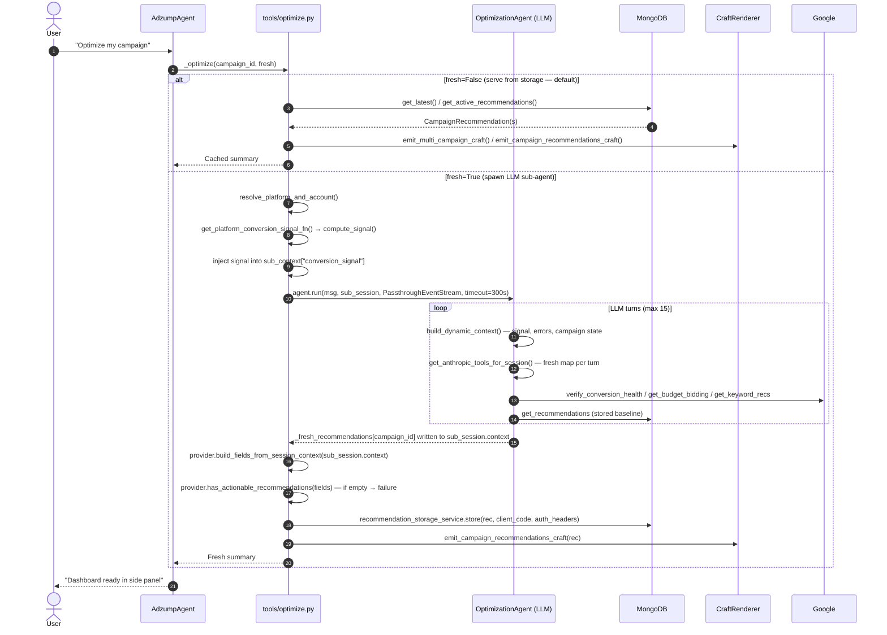
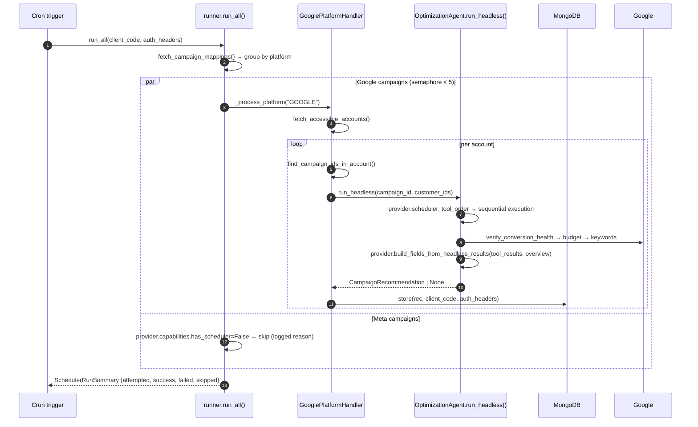
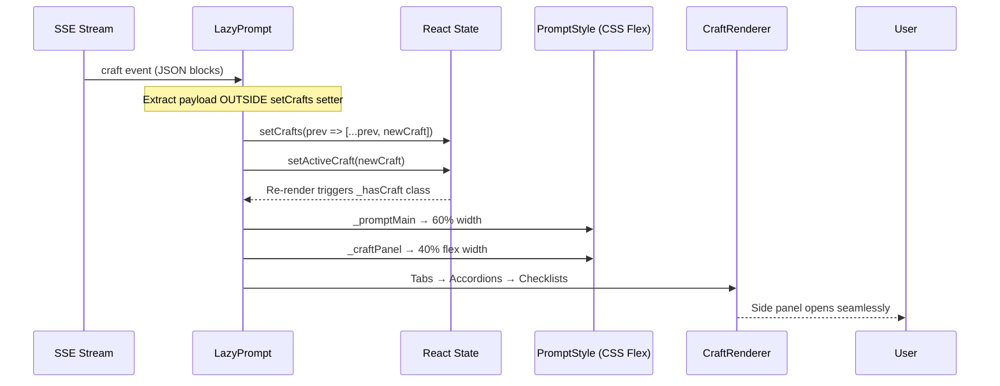
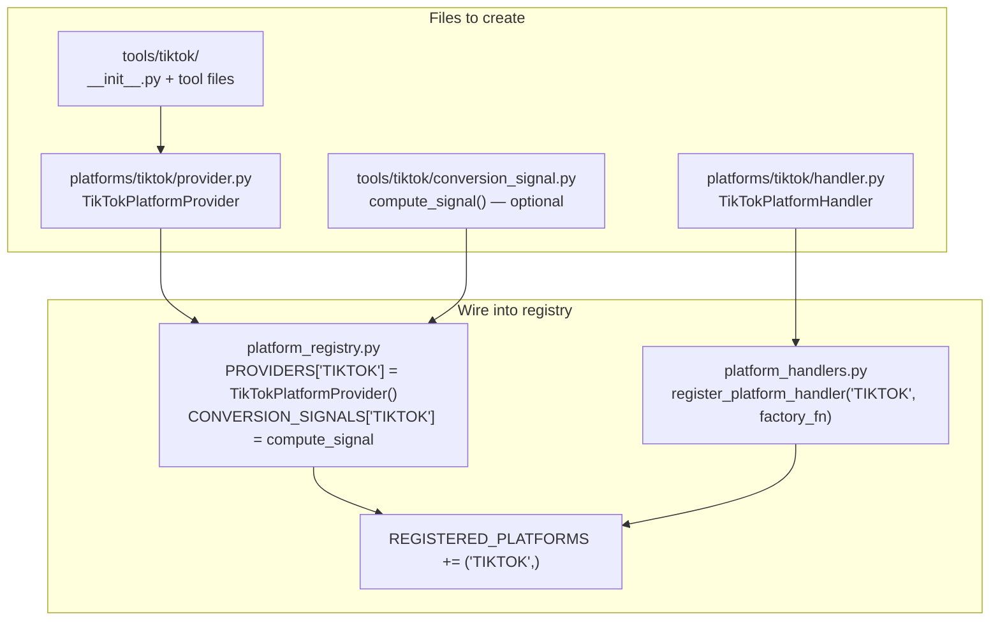

# OptimizationAgent — Architecture & Implementation Reference

Single source of truth for the complete optimization pipeline: architecture, multi-platform design, execution flows, interactive dashboard, storage lifecycle, and what comes next.

---

## Table of Contents

1. [File Map](#file-map)
2. [Architecture Overview](#architecture-overview)
3. [Multi-Platform Design](#multi-platform-design)
4. [Execution Flows](#execution-flows)
5. [agent.run() — Phase by Phase](#agentrun--phase-by-phase)
6. [Interactive Dashboard](#interactive-dashboard)
7. [Storage Design & Lifecycle](#storage-design--lifecycle)
8. [Platform Support](#platform-support)
9. [Adding a New Platform](#adding-a-new-platform)
10. [Constants & Configuration](#constants--configuration)
11. [Cooldown Gate](#cooldown-gate)
12. [What We Are Building Next](#what-we-are-building-next)
13. [Long-Term Vision: Recommendations Engine as an MCP Server](#long-term-vision-recommendations-engine-as-an-mcp-server)

---

## File Map

```
agents/optimization/
├── __init__.py              Exports {OptimizationAgent, ScheduledOptimizationRunner}
├── agent.py                 OptimizationAgent — singleton, two execution modes
├── context.py               System prompt + dynamic per-turn context builder
├── models.py                Pydantic models (discriminated union CampaignRecommendation,
│                            WorkflowItem, RecommendationStatus, PlatformCapabilities)
├── platform_registry.py     Platform registry: PROVIDERS, SHARED_TOOLS, helper resolvers
├── platform_handlers.py     PlatformHandler ABC + lazy account-discovery factory
├── provider_base.py         PlatformProvider ABC + PlatformCapabilities + generic_merge_fields()
├── resolver.py              resolve_platform_and_account() — 4-step resolution
├── runner.py                ScheduledOptimizationRunner (nightly batch)
│
├── craft/                   Visual presentation — decoupled from optimize.py
│   ├── __init__.py          Route to platform-specific presenter
│   ├── google.py            Google Ads: metric cards, budget slider, keyword grids, health checks
│   ├── meta.py              Meta Ads: placement cards, budget pacing (partial)
│   └── common.py            Multi-campaign: platform tabs, accordions, checklist trees
│
├── platforms/
│   ├── google/
│   │   ├── provider.py      Full Google implementation: tools, merge, build, summarize, fingerprints
│   │   └── handler.py       GooglePlatformHandler (account discovery)
│   └── meta/
│       ├── provider.py      Stub: capabilities=False, raises NotImplementedError on analysis calls
│       └── handler.py       MetaPlatformHandler (account discovery — implemented)
│
└── tools/
    ├── get_recommendations.py   Shared read-only tool (platform-agnostic DB lookup)
    └── google/
        ├── keyword.py           Keyword analysis + idea service + semantic scorer
        ├── budget.py            Budget/bidding analysis
        ├── verify_conversion_health.py   8 GAQL conversion tracking checks
        └── conversion_signal.py          compute_signal() — pre-fetch utility (not an LLM tool)
```

**Related files:**

| File | Role |
|------|------|
| `app/agents/adzump/tools/optimize.py` | Chat bridge — resolves context, spawns sub-agent, assembles + stores results |
| `app/agents/adzump/services/recommendation_storage.py` | MongoDB persistence layer |
| `app/core/streaming.py` | `AgentEventStream`, `PassthroughEventStream` |
| `app/agents/adzump/adapters/google/` | Google Ads API adapters (client, metrics, recommendations, planner, conversion) |

---

## Architecture Overview

The OptimizationAgent is a **singleton sub-agent** that runs inside the main AdzumpAgent tool loop. It has two discrete execution modes and a platform-provider pattern that isolates all platform-specific logic behind a registry.

```
User message
    │
    ▼
AdzumpAgent (main chat agent)
    │  calls optimize tool
    ▼
tools/optimize.py  ← bridge: resolves platform/account, pre-fetches signal, sets 300s timeout
    │
    ├─ Flow A: stored recs exist → serve from DB → emit Craft dashboard
    │
    └─ Flow B: fresh analysis needed → spawn OptimizationAgent sub-session
                    │
                    ▼
            OptimizationAgent.run()
                    │
                    └─ LLM tool loop (max 15 turns)
                            ├─ verify_conversion_health
                            ├─ get_budget_bidding_recommendations
                            ├─ get_keyword_recommendations  (only if mapping_exists)
                            └─ get_recommendations  (read-only stored baseline)

Scheduler path (no LLM, no streaming):
    ScheduledOptimizationRunner.run_all()
        └─ platform handler discovers accounts
            └─ OptimizationAgent.run_headless()
                └─ provider.scheduler_tool_order → tools run sequentially
```

### Key Design Principles

**Platform isolation via provider registry** — All platform-specific logic lives in `platforms/<platform>/provider.py`. The core agent, runner, and storage are completely platform-blind. They route through `get_provider(platform)` and never branch on platform strings themselves.

**Request-scoped tool schemas** — `get_anthropic_tools_for_session(session)` builds a fresh tool map per request on both `BaseAgent` (formal hook) and `OptimizationAgent` (override). The singleton never mutates shared state — concurrency-safe under parallel Google and Meta requests.

**Graceful degradation** — If a campaign has no product mapping, `get_keyword_recommendations` is hidden from the LLM via the `requires_product_mapping` flag on `ToolDefinition`. Budget and health tools still run. The LLM never sees a tool it cannot safely call.

**Capability boundary** — `PlatformCapabilities` explicitly declares what each platform supports. Unsupported paths (Meta fresh analysis, Meta scheduler) fail cleanly with clear log messages instead of tool errors.

**Fingerprint-based merge** — Every `WorkflowItem` has a stable `fingerprint` (deterministic hash). On re-analysis, `generic_merge_fields()` preserves existing workflow state (`status`, `applied`, `reviewed_at`) for unchanged items and marks missing old items as `superseded`.

**Dynamic context injection** — `context.py` defines only universal agent rules. Platform-specific diagnostics (Google GAQL conversion logic, bidding confidence rules) are fetched via `get_platform_instructions(platform)` and injected into the system prompt per turn.

**Lazy provider tool imports** — `GooglePlatformProvider.tools` uses local imports inside the `@property` so heavy ad SDK dependencies (Pydantic advisors, planner) load only when analysis actually starts, not at server boot.

---

## Multi-Platform Design

### PlatformProvider Contract (`provider_base.py`)

Every platform must implement this interface:

```python
class PlatformProvider(ABC):
    platform_name: str                # "GOOGLE" | "META"
    tools: list[ToolDefinition]       # LLM-callable tools for this platform
    system_instructions: str          # Injected into system prompt each turn
    capabilities: PlatformCapabilities
    scheduler_tool_order: list[str]   # Headless execution sequence

    # Platform-blind assembly contracts
    merge_fields(existing, new, run_id, campaign_id) -> fields
    build_fields_from_headless_results(tool_results, overview) -> fields
    build_fields_from_session_context(session_context) -> fields

    # Utility methods (default implementations in base)
    summarize_fields(fields) -> list[str]
    populate_fingerprints(fields, campaign_id)
    has_actionable_recommendations(fields) -> bool
    calculate_fingerprint(item, campaign_id) -> str
```

### PlatformCapabilities

```python
class PlatformCapabilities(BaseModel):
    has_recommendations: bool = False   # Can run fresh analysis (chat + scheduler)
    has_conversion_signal: bool = False # Can pre-fetch passive conversion signal
    has_scheduler: bool = False         # Scheduler is safe to route here
```

### Discriminated Union Models (`models.py`)

The `CampaignRecommendation` type is a Pydantic discriminated union — the `platform` field routes to the correct concrete model automatically. Storage, the agent, and the runner all accept `CampaignRecommendation` without knowing which platform is active.

```python
class GoogleCampaignRecommendation(BaseCampaignRecommendation):
    platform: Literal["GOOGLE"] = "GOOGLE"
    fields: GoogleOptimizationFields

class MetaCampaignRecommendation(BaseCampaignRecommendation):
    platform: Literal["META"] = "META"
    fields: MetaOptimizationFields

CampaignRecommendation = Annotated[
    Union[GoogleCampaignRecommendation, MetaCampaignRecommendation],
    Field(discriminator="platform")
]
```

`BaseCampaignRecommendation` carries the common top-level fields that every platform shares:

```python
class BaseCampaignRecommendation(CamelModel):
    id: Optional[str] = Field(None, alias="_id")
    platform: str
    campaign_id: str
    campaign_name: str
    account_id: str = ""
    parent_account_id: str = ""
    product_id: str = ""
    product_name: str = ""
    source: str = ""              # "user_requested" | "scheduler" | "endpoint"
    generated_at: str = ""
    schema_version: str = "1.0"
    completed: bool = False
    active: bool = True
```

### WorkflowItem Lifecycle (`models.py`)

Every recommendation item inherits `WorkflowItem`. This is the per-item state machine for the human review workflow:

```python
class WorkflowItem(CamelModel):
    status: RecommendationStatus = RecommendationStatus.PENDING
    applied: bool = False
    reviewed_at: str = ""
    reviewed_by: str = ""
    applied_at: str = ""
    failure_reason: str = ""
    fingerprint: str = ""
    source_run_id: str = ""

    def compute_fingerprint(self, campaign_id: str) -> str:
        # Each subclass implements this with platform-stable identity fields
        ...
```

```
Status transitions:
pending ──► accepted ──► applying ──► applied
        │              └──────────► failed
        └──► rejected
pending/accepted ─────────────────► stale | superseded
```

The `fingerprint` is a deterministic hash — stable across runs for the same underlying recommendation. Examples:

| Type | Fingerprint components |
|------|----------------------|
| Keyword PAUSE | `platform + account_id + campaign_id + ad_group_id + criterion_id + "PAUSE"` |
| Keyword ADD | `platform + account_id + campaign_id + ad_group_id + normalized_text + match_type + "ADD"` |
| Budget change | `platform + account_id + campaign_id + scope + rec_type` |
| Conversion fix | `platform + account_id + campaign_id + check_id + affected_entity_ids` |

### Registry (`platform_registry.py`)

```python
PROVIDERS: dict[str, PlatformProvider] = {
    "GOOGLE": GooglePlatformProvider(),
    "META":   MetaPlatformProvider(),   # stub — has_recommendations=False
}

CONVERSION_SIGNALS: dict[str, Callable] = {
    "GOOGLE": google_compute_signal,    # async fn, not a ToolDefinition
}

SHARED_TOOLS = [get_recommendations]   # platform-agnostic, always available
REGISTERED_PLATFORMS = ("GOOGLE", "META")

# Helper functions — import these, never instantiate providers directly
get_provider(platform)                        # → PlatformProvider | None
get_platform_conversion_signal_fn(platform)   # → async fn | None
build_optimization_tool_map(platform)         # → request-scoped dict[str, ToolDefinition]
normalize_platform(platform)                  # "google ads" → "GOOGLE", unknown → None
validate_platform_tools()                     # startup check — import all platform packages
```

---

## Execution Flows

### Chat Path (LLM sub-agent)



### Scheduler Path (headless)



---

## agent.run() — Phase by Phase

### Phase 1: Platform normalization

```python
async def run(self, user_message, session, event_stream, ...):
    platform = session.context.get("platform")
    if platform:
        session.context["platform"] = normalize_platform(platform)
    return await super().run(...)
```

The bridge (`tools/optimize.py`) always pre-resolves platform/account before calling `agent.run()`. This phase only normalizes casing — no re-resolution happens inside the agent.

### Phase 2: Nested agent lifecycle

```python
parent_id = current_agent_id.get()     # "root" from AdzumpAgent
is_nested = parent_id != "root"        # True — this is a sub-agent
if is_nested:
    await event_stream.emit_agent_started(agent_id, label, parent_id, parent_tool_use_id)
try:
    await self._run_loop(...)
except (CancelledError, Exception):
    raise   # tools/optimize.py catches, emits agent_finished, returns ToolResult
finally:
    current_agent_id.reset(ctx_token)
```

`PassthroughEventStream` (from `app/core/streaming.py`) wraps the parent stream. Progress events (`tool_start`, `tool_result`, `agent_started`, `craft`) pass through to the UI. `done`/`error` are silenced — the parent agent owns the session lifecycle.

### Phase 3: _run_loop() — core LLM loop

Each turn:
1. `build_dynamic_context(session)` — renders campaign ID, platform, conversion signal, recent tool errors
2. `get_anthropic_tools_for_session(session)` → `_get_filtered_tools(session)` → `build_optimization_tool_map(platform)` — fresh dict every turn, never touches singleton state
3. Tool schema filtered: `mapping_exists=False` hides `get_keyword_recommendations` via `requires_product_mapping` flag
4. LLM streams; tool calls are parsed and executed via `_execute_tool()`; results appended for next turn
5. Repeat until `stop_reason != "tool_use"` or max 15 turns

### Phase 4: Request-scoped tool execution

`OptimizationAgent` overrides `_execute_tool()` so the singleton never touches `self.tools`:

```python
def _execute_tool(self, tool_name, tool_input, session, event_stream, tool_use_id):
    tool = self._get_platform_tool_map(session).get(tool_name)   # fresh per call
    context = self.build_tool_context(session)
    context["event_stream"] = event_stream
    context["tool_use_id"] = tool_use_id
    return await tool.execute(tool_input, context)
```

`BaseAgent` has the formal `get_anthropic_tools_for_session(session)` hook at the class level. `OptimizationAgent` overrides it to return `_get_filtered_tools(session)`. `_run_loop()` calls the hook — no `hasattr` duck-typing.

### Phase 5: Conversion signal pre-fetch (tools/optimize.py bridge)

```
platform_registry.get_platform_conversion_signal_fn(platform)
  └─ tools/google/conversion_signal.py:compute_signal()
       └─ adapters/google/conversion_metrics.py:fetch_conversion_signal()
            └─ adapters/google/conversion_enums.py  (QueryWindow, enums)

Result injected: sub_context["conversion_signal"] = signal.model_dump()
  └─ build_dynamic_context() reads it on turn 1
       └─ LLM sees "Conversion tracking: ✓ stable" — zero wasted tool-call turns

False-positive guards:
  MIN_PRIOR_VOLUME = 20          prior 14d must have ≥ 20 conversions
  DROPPING_THRESHOLD = -0.20     −20% delta triggers DROPPING
  MIN_CAMPAIGN_AGE_DAYS = 30     campaigns < 30d → INSUFFICIENT_HISTORY
  _MAX_SPEND_MULTIPLIER = 3.0    Maximize Conversions gets −60% threshold instead
```

---

## Interactive Dashboard

The Craft panel (chat side panel) is the complete interactive cockpit. Rather than redirecting users to separate pages, the panel serves as the arena where the user reviews, manipulates, and commits all optimization decisions.

### Layout

```
Craft Panel
├── Horizontal Platform Tabs  [Google Ads] [Meta Ads] [TikTok Ads ...]
│   Scrollable, infinitely extensible
└── Campaign Accordions  (▲/▼ per campaign)
    └── Recommendation sections
        ├── Conversion health check cards
        ├── Budget/bidding metric cards + RangeSlider (customizable target budget)
        └── Keyword checklist  (CommonCheckbox per item)
            └── [Apply Changes] → [Applying...] → [Applied ✓]
```

### What Is Implemented (Frontend — nocode-ui repo)

**Phase 1 — Tabs & Accordions:**
- `TabsBlock` in `CraftRenderer.tsx` — uses SaaS-native class names (`comp compTabs _horizontal`, `tabsContainer`, `tabDiv`, `tabGridDiv`) so it inherits the application's exact tab visual treatment and active line animation
- `AccordionBlock` in `CraftRenderer.tsx` — smooth expand/collapse with chevrons per campaign

**Phase 2 — Interactive Checklists & Sliders:**
- `ChecklistBlock` in `CraftRenderer.tsx` — per-item Accept/Reject state managed in browser until Apply is clicked
- Reuses `<CommonCheckbox>` — SaaS standard checkbox component for individual item toggles
- Reuses `<RangeSlider>` — lets users customize target daily budgets directly in the panel
- Apply state machine: `[Apply Campaign Changes]` → `[Applying Selections...]` (spinner) → `[Changes Applied ✓]` (green checkmark)

**Global styles** in `PromptStyle.tsx` — tabs, chevrons, accordions, checkbox overlays, range sliders, active/applied button states.

### Frontend SSE → State Flow

The Craft panel state is maintained by decoupling SSE parsing from React's state setter anti-patterns:



### Backend Craft Modules

| Module | What it emits |
|--------|---------------|
| `craft/google.py` | Metric stat cards, budget slider cards (using `bb.budget_rec_rationale`), keyword grids, 8 conversion health check cards |
| `craft/meta.py` | Placement cards, budget pacing cards (partial — no CampaignOverview yet) |
| `craft/common.py` | Multi-campaign platform tabs via `PLATFORM_DISPLAY_NAMES`, campaign accordions, checklist trees |

Platform tab labels use `PLATFORM_DISPLAY_NAMES = {"GOOGLE": "Google Ads", "META": "Meta Ads"}` with a `.get(plat, f"{plat.title()} Ads")` fallback so future platforms never display as "Meta Ads".

---

## Storage Design & Lifecycle

### The Human Review Workflow

A recommendation is not just an analysis result — it is the state container for the user's review workflow:

1. Analysis run (scheduler or fresh scan) generates candidate actions for a campaign
2. Storage keeps the campaign recommendation `active=True, completed=False`
3. The Craft dashboard shows all active recommendations to the user
4. User audits individual items: accepts, rejects, or defers each
5. User clicks Apply — frontend sends selected actions to the backend mutation service
6. Mutation service builds platform-specific payloads and calls the ad API
7. After mutation success, storage marks items `applied=True`; failed items get `failure_reason`
8. Campaign remains `completed=False` while any pending/failed items remain
9. Campaign becomes `completed=True` only when the user resolves all actionable items

**The user is the authority.** Fresh analysis and scheduler runs generate candidates. They must not silently override the user's review decisions — this is why fingerprint-based merging exists.

### Storage Service Behavior (`recommendation_storage.py`)

`store()` follows a create-then-retire pattern with fingerprint-aware merging:

1. Fetch latest `completed=False` record for `campaign_id + client_code`
2. `provider.merge_fields(existing_fields, new_fields, run_id, campaign_id)` — fingerprint-aware
3. `_build_recommendation()` — write full document to MongoDB with all metadata fields
4. Mark previous record `completed=True`
5. Post-store cleanup: retire any additional duplicate active records for same key

`_build_recommendation()` writes all required top-level fields:

```python
{
    "platform": rec.platform,
    "campaignId": rec.campaign_id,
    "campaignName": rec.campaign_name,
    "accountId": rec.account_id,
    "parentAccountId": rec.parent_account_id,
    "productId": rec.product_id,
    "productName": product_name,           # resolved at store time
    "source": rec.source,
    "generatedAt": rec.generated_at or utcnow(),
    "schemaVersion": rec.schema_version,
    "completed": False,
    "active": True,
    "fields": { ... platform-specific ... },
}
```

### Fingerprint-Based Merge (`generic_merge_fields` in `provider_base.py`)

```
For WorkflowItem lists (keywords, etc.):
  Match existing items by fingerprint

  → Matched item:  copy status, applied, reviewed_at, reviewed_by, applied_at, failure_reason
                   (preserve all user review decisions)
  → New item:      insert as pending, applied=False
  → Old pending item not in new run: mark superseded

For object fields with fingerprint (budget_bidding, etc.):
  → Same fingerprint: preserve workflow state
  → Different fingerprint: replace with new data

Overview: always replaced by latest run
```

Concrete merge behaviors:

| Scenario | Result |
|----------|--------|
| User marked keyword `applied=True`, new scan has same keyword | Applied state preserved |
| User rejected a keyword, new scan regenerates exact same keyword | Stays rejected |
| New scan adds a keyword the user has never seen | Inserted as pending |
| Old pending keyword drops out of new scan | Marked superseded |
| Scheduler runs for a campaign the user already partially applied | Applied items unchanged; new items added as pending |

### Storage Reads

`get_latest()` resolution order:

1. By campaign ID (exact match)
2. By campaign name (normalized, sort by `updatedAt DESC`)
3. By product name (LIKE, sort by `updatedAt DESC`)
4. Returns `None` if no active record found

All three lookups use `normalize_platform(platform)` before filtering so `"google ads"` matches stored `"GOOGLE"` records.

### The Mutation Apply Flow (current — simulation only)

The frontend currently runs a simulated apply state machine. The real backend mutation service (Phase 3 below) is not yet implemented. The current apply button shows the UX states correctly but does not call the ad platform API.

The designed API surface for when this is built:

```
POST /recommendations/{rec_id}/apply
Body: {
  "recordVersion": "2026-06-09T...",   # OCC — reject 409 if stale
  "actions": [
    {"fingerprint": "kw:...", "action": "accept"},
    {"fingerprint": "negkw:...", "action": "reject"}
  ]
}
```

Server-side flow:
1. Authenticate + authorize
2. Load active record; validate `recordVersion` → 409 if stale
3. Resolve fingerprints → 400 if any unknown
4. Persist review decisions via `sync_mutation_result()` (defensive re-read, fingerprint-scoped write)
5. Mark accepted items `status=applying`; persist
6. `provider.build_mutation_payload(accepted_items)` → platform API payload
7. `provider.execute_mutation(payload, auth_headers)`
8. On response: items → `applied` or `failed + failure_reason`
9. Re-emit Craft blocks with final states

### Recommended Production Storage Model

The current create-then-retire pattern works but creates a risk of duplicate active records under concurrent writes. The recommended production shape:

```
Active recommendations collection:
  One row per (client_code + platform + account_id + campaign_id)
  Updated in-place

History snapshots collection:
  Immutable — one row per generation run
  Includes: run_id, source, tool_results, failure reasons

Run log collection:
  One row per scheduler/fresh run
  Status: success | partial_success | skipped | failed
```

Until separate collections are available: the current create-new pattern plus the post-store duplicate cleanup provides acceptable safety.

---

## Platform Support

| Capability | Google | Meta |
|---|---|---|
| Account / campaign discovery | ✅ | ✅ |
| Platform resolution (resolver) | ✅ | ✅ |
| LLM-orchestrated fresh analysis | ✅ | ❌ "not implemented" message |
| Scheduler headless analysis | ✅ | ❌ skipped (`has_scheduler=False`) |
| Conversion signal pre-fetch | ✅ | ❌ |
| Conversion health (8 GAQL checks) | ✅ | ❌ |
| Budget / bidding recommendations | ✅ | ❌ |
| Keyword analysis + idea service | ✅ | ❌ |
| Stored recommendation read | ✅ | ✅ |
| Craft dashboard rendering | ✅ | ✅ partial |
| Fingerprint merge + workflow lifecycle | ✅ | ❌ raises NotImplementedError |
| `merge_fields` / `build_fields_*` | ✅ | ❌ raises NotImplementedError |
| Platform tab display name | ✅ "Google Ads" | ✅ "Meta Ads" |

Meta has a `MetaPlatformProvider` stub registered in `PROVIDERS["META"]` so `get_provider("META")` never returns `None` — callers always get a provider with `capabilities.has_recommendations=False` instead of a `KeyError`. The stub's `merge_fields`, `build_fields_from_headless_results`, and `build_fields_from_session_context` raise `NotImplementedError` — callers (storage, runner, optimize.py) check `capabilities` before calling these.

---

## Adding a New Platform

The agent, runner, optimize bridge, and storage service are fully platform-blind. Adding a new platform requires only:



Steps in detail:

1. **`platforms/tiktok/provider.py`** — implement all `PlatformProvider` abstract methods; set `capabilities` truthfully
2. **`platforms/tiktok/handler.py`** — implement `PlatformHandler` ABC for account/campaign discovery
3. **`tools/tiktok/__init__.py`** — export `ALL_TOOLS` + `PLATFORM_INSTRUCTIONS` constant
4. **`tools/tiktok/conversion_signal.py`** — implement `compute_signal()` if TikTok supports passive signal
5. **`platform_registry.py`** — register provider instance and optional signal function
6. **`platform_handlers.py`** — register handler factory
7. **`REGISTERED_PLATFORMS`** — add `"TIKTOK"` to the tuple

`validate_platform_tools()` (called at startup) will import the new package and surface any missing dependencies immediately.

---

## Constants & Configuration

| Constant / Setting | Value | Location |
|--------------------|-------|----------|
| `OPTIMIZATION_MAX_TURNS` | 15 | `agent.py:49` |
| `OPTIMIZATION_MAX_TOKENS` | 8192 | `agent.py:50` |
| `OPTIMIZATION_MODEL_OVERRIDE` | `"openai:gpt-4o"` | `tools/optimize.py:42` |
| Sub-agent timeout | 300 seconds | `tools/optimize.py` |
| `_MAX_CONCURRENT_CAMPAIGNS` | 5 (semaphore) | `runner.py:53` |
| `SHARED_TOOLS` | `[get_recommendations]` | `platform_registry.py` |
| `REGISTERED_PLATFORMS` | `("GOOGLE", "META")` | `platform_registry.py` |
| `MIN_PRIOR_VOLUME` | 20 conversions in prior 14d | `tools/google/conversion_signal.py` |
| `DROPPING_THRESHOLD` | -0.20 (−20% delta → DROPPING) | `tools/google/conversion_signal.py` |
| `MIN_CAMPAIGN_AGE_DAYS` | 30 | `tools/google/conversion_signal.py` |
| `_MAX_SPEND_MULTIPLIER` | 3.0 (Maximize Conversions → −60% threshold) | `tools/google/conversion_signal.py` |
| `PLATFORM_DISPLAY_NAMES` | `{"GOOGLE": "Google Ads", "META": "Meta Ads"}` | `craft/common.py` |
| `_COOLDOWN_HOURS["scheduler"]` | 20 hours | `tools/optimize.py` |
| `_COOLDOWN_HOURS["user_requested"]` | 4 hours | `tools/optimize.py` |
| `_DEFAULT_COOLDOWN_HOURS` | 20 hours | `tools/optimize.py` |

---

## Cooldown Gate

Implemented in `tools/optimize.py`. Intercepts `fresh=True` requests before spawning an OptimizationAgent sub-agent, checking whether a recent stored recommendation already exists for the campaign.

### Why it exists

Ad platform performance data (impressions, conversions, spend) has a reporting lag of up to 24 hours. Re-running a full sub-agent scan within that window produces near-identical recommendations at unnecessary LLM cost. The cooldown gate prevents this by serving the stored analysis instead.

### How it works

1. When `fresh=True` is requested, after verifying session/auth/stream are valid, call `recommendation_storage_service.get_latest(campaign_id)`.
2. Parse `generated_at` from the stored record.
3. Compute `age_hours = now - generated_at`.
4. Compare against the source-specific cooldown window:
   - `source="scheduler"` → 20 hours (nightly scheduler ran; data won't settle until next evening)
   - `source="user_requested"` → 4 hours (user ran a manual scan recently)
5. If `age_hours < cooldown_hours`: serve the stored recommendation via `_serve_from_storage()` and append a `[COOLDOWN]` note to the ToolResult summary. The LLM uses this note to explain the data lag to the user and offer a force refresh.
6. If `age_hours >= cooldown_hours` or no stored rec exists: proceed to `_fresh_analysis()` normally.

### Escape hatch — `force_refresh`

The `optimize` tool accepts a `force_refresh: bool` parameter. When set `True`, the cooldown gate is skipped entirely and a fresh sub-agent scan always runs. The LLM should only set this after it has already told the user about the existing analysis and the user confirmed they want a new scan anyway.

### Error handling

If the `get_latest()` lookup itself fails (network error, storage outage), the gate fails open — the error is logged as a warning and `_fresh_analysis()` runs normally. The gate never blocks a fresh scan due to its own failure.

---

## What We Are Building Next

### 1. Meta Recommendation Tools

Create the full `tools/meta/` package and fill in `MetaPlatformProvider`:

- Implement budget/pacing tool using Meta Graph API
- Implement placement analysis tool
- Implement `compute_signal()` for Meta conversion signal
- Fill in `MetaOptimizationFields` (currently a placeholder in `models.py`)
- Implement `MetaPlatformProvider.merge_fields()`, `build_fields_from_headless_results()`, `build_fields_from_session_context()`
- Set `capabilities.has_recommendations=True, has_scheduler=True`
- Register `CONVERSION_SIGNALS["META"] = meta_compute_signal`

Once done: scheduler routes Meta campaigns through `run_headless()`, Craft renders full Meta dashboards, and the discriminated union model selects `MetaCampaignRecommendation` automatically.

### 2. Backend Mutation Service

The apply button currently simulates the UX. The real backend service needs to be built under `app/agents/adzump/services/`:

- `GoogleAdsMutationService` — builds `AdGroupCriterionOperation`, `CampaignBudgetOperation`, etc.
- `POST /recommendations/{rec_id}/apply` endpoint — OCC validation, fingerprint resolution, storage update, provider mutation call
- Add `build_mutation_payload(accepted_items)` and `execute_mutation(payload, auth_headers)` to `GooglePlatformProvider`
- OCC: validate `recordVersion` / `updatedAt` on every apply call; return 409 if stale

The storage service already has `sync_mutation_result()` and threads `auth_headers` through all update paths — the mutation service plugs into the existing storage contracts.

#### UI Button Contract

The frontend (`CraftRenderer.tsx` — `SuggestionListBlock`) has three levels of interaction. Only the final "Apply" actions make API calls — everything above that is local React state:

| Button | API call? | Notes |
|--------|-----------|-------|
| Accept item | No | Local `statuses` state only |
| Reject item | No | Local `statuses` state only |
| Undo item | No | Local `statuses` state only |
| Accept All | No | Bulk-toggle `statuses` map |
| Reject All | No | Bulk-toggle `statuses` map |
| Apply Campaign Changes | **Yes — one POST** | `POST /recommendations/{rec_id}/apply` |
| Apply All (dashboard) | **Yes — one POST per campaign** | Client-side `Promise.all` loop, parallel |

#### Apply Campaign Changes — request shape

```
POST /recommendations/{rec_id}/apply
Authorization: Bearer {jwt}
clientCode: {client_code}

{
  "accepted_ids": ["kw_001", "kw_003"],   // WorkflowItem fingerprints the user accepted
  "rejected_ids": ["kw_002"],             // WorkflowItem fingerprints the user rejected
  "budget": 85                            // only present when budget slider was shown
}
```

Backend steps:
1. OCC check — validate `recordVersion`/`updatedAt`; return 409 if stale
2. Resolve `accepted_ids` → `WorkflowItem` list via fingerprint lookup
3. Call `provider.build_mutation_payload(accepted_items)` → platform-specific operations
4. Call `provider.execute_mutation(payload, auth_headers)` → Google/Meta API
5. On success: `sync_mutation_result()` — mark accepted items `applied=True, status=APPLIED`, rejected items `status=REJECTED`
6. Return updated statuses so the UI reflects confirmed state (not optimistic)

#### Apply All (dashboard level) — client-side loop

Do **not** make a batch endpoint. The UI iterates each campaign card with accepted items and fires one POST per campaign in parallel:

```ts
await Promise.all(
    campaignCards
        .filter(c => c.hasAcceptedItems)
        .map(c => applyRecommendation(c.recId, c.acceptedIds, c.rejectedIds, c.budget))
);
```

Each campaign's result is independent — one mutation failure does not block the others. Progress and error state are shown per campaign card.

#### UI prop change required in `SuggestionListBlock`

The component currently does not receive the recommendation storage document ID. One prop needs to be added:

```ts
// Add to SuggestionListBlock interface:
recId: string;   // recommendation document ID — needed for the apply POST URL
```

The Python backend already has `rec_id` when emitting Craft blocks — it just needs to be included as a field in the `suggestion_list` block payload so it flows through to the component. No other component changes are required.

### 3. Storage Collection Split

Move from single-collection create-then-retire to a proper two-collection design:

- **Active** collection: one row per `(client_code + platform + account_id + campaign_id)`, updated in-place
- **History** collection: immutable snapshots, one row per generation run

Also: unify storage writes to canonical camelCase via `model_dump(by_alias=True, exclude_none=True)` throughout, eliminating the remaining ad-hoc `camelize_dict()` calls.

### 4. Test Suite

Minimum coverage needed:

| Test | What it verifies |
|------|-----------------|
| `store()` first run | Single active record, all metadata fields present, all items `pending` |
| `store()` second run | `applied=True` items stay applied; new items inserted as `pending`; dropped items → `superseded` |
| `store()` concurrent | No duplicate active records under race condition |
| `OptimizationAgent` concurrency | Two simultaneous sessions with different platforms don't share tool schemas |
| `_get_filtered_tools()` | Unmapped campaign hides keyword tool; Meta exposes only shared tool |
| Platform filter | `"google ads"` input returns Google records (normalize applied) |
| Fresh scan empty | `has_actionable_recommendations=False` → `success=False` returned |
| Craft budget render | `bb.budget_rec_rationale` renders without `AttributeError` |
| Unknown platform tab | Falls back to `f"{plat.title()} Ads"`, not "Meta Ads" |
| OCC on apply | Stale `recordVersion` → 409; correct version → proceeds |

### 5. Model Override from Settings

Move the hardcoded `"openai:gpt-4o"` to a config setting so operations can change it per environment without a code deploy:

```python
from app.core.config import settings
OPTIMIZATION_MODEL_OVERRIDE = getattr(settings, "ADZUMP_OPTIMIZATION_MODEL", "openai:gpt-4o")
```

### 6. Impact Measurement (Feedback Loop)

Show users whether the recommendations they applied actually improved their campaign — closing the loop between the analysis and the real-world outcome.

#### Design: lazy-fetch, no new collection

- Add `post_apply_overview: Optional[dict]` field to `BaseCampaignRecommendation` (in `models.py`).
  - Populated lazily (never at generation time).
  - Stores the same shape as `fields.overview` (CPA, conversions, spend, ROAS) — the "after" snapshot.
- The "before" snapshot is already captured in `fields.overview` at analysis time. No schema change needed there.
- No new cron job, no new storage collection. The existing `campaignSuggestions` collection gains one optional field.

#### When to fetch

When the user views stored recommendations (via `_serve_from_storage`), check:

1. Does the stored record have any `applied=True` items?
2. Is the earliest `applied_at` timestamp older than 7 days?

If both are true and `post_apply_overview` is not yet set: call the platform handler to fetch current campaign metrics and write them back to the record via a partial update (`recommendation_storage_service.update_partial(rec_id, {"postApplyOverview": ...})`).

#### What to show

When `post_apply_overview` is set, the Craft panel can display a comparison card alongside the existing overview:

```
Before (at time of analysis):  CPA $18.40 | Conversions 47 | Spend $864
After  (7+ days post-apply):   CPA $14.20 | Conversions 63 | Spend $892

Change: CPA −22.8% ✓  |  Conversions +34% ✓  |  Spend +3.2%
```

Label it **"Performance change since recommendations were applied"** — not "improvement" — because ad performance has many confounding factors (seasonality, competition, budget changes).

#### Why not at apply-time

At the moment of apply, the mutation service has just written to the platform API. The ad platform takes hours to reflect the change in its reporting API. Fetching immediately would give the same numbers as `fields.overview`.

#### Dependencies

- Backend Mutation Service (item 2 above) must be built first so `applied=True` reflects a real platform API success, not frontend self-reporting.
- Platform handler needs a `get_campaign_overview(campaign_id, auth_headers)` call — Google already has the metrics needed via the existing reporting tool internals; this is a thin wrapper.
- The partial update path in `recommendation_storage_service` must thread `auth_headers` correctly (tracked as bug M6 in the production readiness review).

---

## Long-Term Vision: Recommendations Engine as an MCP Server

> **Prerequisite:** All items in "What We Are Building Next" (Meta tools, mutation service, storage split, test suite, impact measurement) should be complete before considering this. The engine needs to be stable and self-contained first.

Once the recommendations engine is fully built out, it can be extracted as a standalone **MCP (Model Context Protocol) server** — making it consumable by any LLM host (Claude.ai, Cursor, other internal agents) without coupling to `AdzumpAgent`.

### What this enables

- Any agent or LLM host can call `optimize(campaign_id)` or read `recommendations://campaign/{id}` without knowing about AdzumpAgent internals
- Other product teams can consume campaign recommendations from their own agents
- The engine becomes a platform capability, not a feature buried inside one agent

### What's already MCP-ready

The architecture is already close:
- `ToolDefinition` / `ToolParameter` / `ToolResult` are protocol-agnostic — they don't assume Anthropic's wire format
- The storage service and platform handlers are pure HTTP — they work fine from any process
- The cooldown gate, resolver, and provider contracts are stateless — trivial to expose as tools
- The 4-layer design (Flow → Platform → Provider → Tools) already separates logic from transport

### The one real blocker: SSE streaming

The Craft panel emission (`_safe_emit_craft`), `PassthroughEventStream`, and sub-agent progress events all rely on an `AgentEventStream` being injected at call time. MCP tools are request-response — there is no equivalent of passing a live SSE stream into a tool call.

**Fix:** Once the mutation service is the source of truth for all frontend state, the Craft panel can shift from server-push SSE to a polling model (the client polls a resource URI after the tool returns). That removes the streaming dependency and the MCP extraction becomes straightforward.

### Other items to resolve before extraction

- **Auth:** `client_code` and `auth` headers are currently injected via Python `context` dict (in-process only). An MCP server needs auth injected at startup per-tenant, or passed as a structured tool argument.
- **Sub-agent thickness:** `spawn_sub_agent()` launches a full LLM loop inside the tool call. This is valid under Claude's "agentic MCP" pattern (the MCP SDK supports it explicitly), but it means the MCP server is a heavy, stateful service — a deliberate design decision to make when the time comes.
- **Scheduler stays separate:** The nightly `ScheduledOptimizationRunner` is a background job, not a request-response operation. It stays as a standalone service and is not exposed via MCP.
